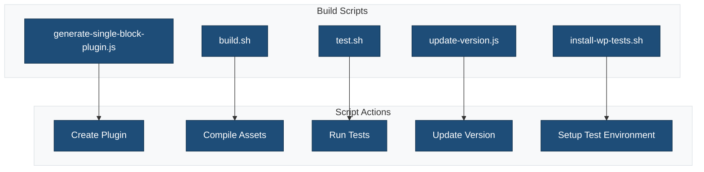
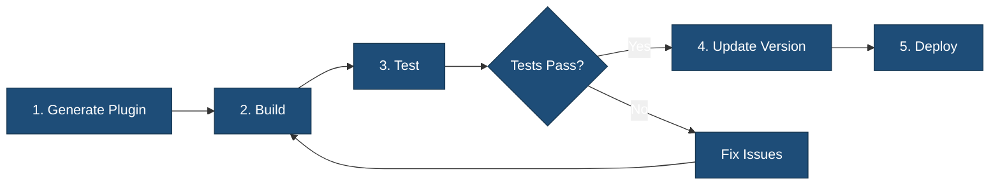

# Build Scripts

This directory contains build and generation scripts for the single block plugin scaffold.

## Overview



## Scripts

### `generate-single-block-plugin.js`

Generates a new plugin from the scaffold template.

**Usage:**

```bash
node bin/generate-single-block-plugin.js \
  --slug my-block \
  --name "My Block" \
  --description "A custom block" \
  --author "Your Name" \
  --author_uri "https://example.com" \
  --version "1.0.0"
```

**Arguments:**

| Argument | Required | Description |
|----------|----------|-------------|
| `--slug` | Yes | Plugin slug (kebab-case) |
| `--name` | No | Plugin display name |
| `--description` | No | Plugin description |
| `--author` | No | Author name |
| `--author_uri` | No | Author website URL |
| `--version` | No | Plugin version |

### `build.sh`

Builds the plugin by installing dependencies, linting, and compiling assets.

**Usage:**

```bash
./bin/build.sh
```

**Actions:**
1. Installs npm dependencies
2. Installs composer dependencies
3. Runs linters (PHP, JS, CSS)
4. Builds production assets
5. Runs tests

### `test.sh`

Runs all test suites for the plugin.

**Usage:**

```bash
./bin/test.sh
```

**Runs:**
- PHPUnit tests
- Jest tests
- Linting checks

### `update-version.js`

Updates the version number across all plugin files.

**Usage:**

```bash
node bin/update-version.js 1.2.0
```

**Updates:**
- Main plugin file header
- `package.json`
- `readme.txt`
- `composer.json`

### `install-wp-tests.sh`

Sets up the WordPress test environment for PHPUnit.

**Usage:**

```bash
./bin/install-wp-tests.sh <db-name> <db-user> <db-pass> [db-host] [wp-version]
```

**Example:**

```bash
./bin/install-wp-tests.sh wordpress_test root '' localhost latest
```

## Script Flow



## Related Documentation

- [Plugin Generation Guide](../docs/generate-plugin.md)
- [Development Guide](../DEVELOPMENT.md)
- [Contributing Guidelines](../CONTRIBUTING.md)
