# Single Block Plugin Scaffold - Setup Summary

## ✅ Completed Tasks

### 1. Block Development Structure

**Created Block Files:**

- `src/{{slug}}/block.json` - Block metadata and registration
- `src/{{slug}}/edit.js` - Edit component for block editor
- `src/{{slug}}/save.js` - Save component for frontend rendering
- `src/{{slug}}/style.scss` - Block-specific styles
- `src/{{slug}}/render.php` - Optional dynamic rendering

**Entry Point:**

- `src/index.js` - Main entry point for block registration

**Benefits:**

- Modern block development workflow
- Component-based architecture
- Reusable block across WordPress sites
- Proper internationalization support
- Editor and frontend separation

### 2. Build Process Configuration

**Webpack Configuration (`.webpack.config.cjs`):**

- Extends `@wordpress/scripts` for WordPress block development
- Single entry point for block registration: `src/index.js`
- Output directory: `build/`
- Path aliases: `@`, `@scss`
- Asset handling for images and fonts
- Block metadata processing from `block.json`
- Performance optimization for block bundles

**Package.json Scripts:**

- `npm run start` - Development mode with hot reload
- `npm run build` - Production build
- `npm run plugin-zip` - Create installable plugin ZIP
- `npm run makepot` - Generate translation template
- Linting and testing scripts

**Asset Management:**

- Block JavaScript: `build/index.js`
- Block styles: `build/index.css`
- Frontend styles: `build/style-index.css`
- Automatic dependency management via `build/index.asset.php`
- Block metadata: `build/{{slug}}/block.json`

### 3. Internationalization (i18n)

**Setup:**

- Text domain: `{{slug}}`
- Translation loading in `{{slug}}.php`
- Languages directory: `languages/`
- POT file generation: `npm run makepot`

**Implementation:**

- All block files use proper i18n functions
- Translation-ready text in edit.js and save.js
- Proper escaping with `esc_html_e()`, `esc_html__()` in PHP
- JavaScript translation support via `@wordpress/i18n`
- Context support for translators

**Usage Examples:**

```javascript
import { __ } from '@wordpress/i18n';

const title = __( 'Block Title', '{{slug}}' );
const label = _x( 'Label', 'Context', '{{slug}}' );
```

```php
<?php esc_html_e( 'Text', '{{slug}}' ); ?>
<?php echo esc_html_x( 'Text', 'Context', '{{slug}}' ); ?>
```

### 4. File Updates

**`{{slug}}.php`:**

- Added `load_plugin_textdomain()` for i18n support
- Block registration via `register_block_type()`
- Automatic asset enqueuing from `block.json`
- Plugin activation and deactivation hooks

**`.gitignore`:**

- Excludes build output
- Includes languages directory
- Excludes compiled `.mo` files, keeps `.pot` files
- Excludes plugin ZIP files

**`bin/build.sh`:**

- Automated plugin packaging script
- Creates installable ZIP file
- Excludes development files

### 5. Documentation

**Created `docs/BUILD-PROCESS.md`:**

- Complete build process documentation for blocks
- Development and production workflows
- Block registration and asset loading
- Internationalization guide for blocks
- Linting and testing instructions
- WordPress environment setup
- Performance optimization details for blocks
- Troubleshooting guide

**Created Block Documentation:**

- Block metadata structure
- Edit and save component patterns
- Block styles organization
- Dynamic rendering with PHP

## 📋 Template Variables

All files use mustache-style placeholders that are replaced during plugin generation:

| Variable | Description |
|----------|-------------|
| `{{slug}}` | Plugin slug (kebab-case) |
| `{{name}}` | Human-readable plugin name |
| `{{namespace}}` | Plugin namespace (for PHP) |
| `{{version}}` | Plugin version |
| And more... | See package.json metadata |

## 🚀 Next Steps for Generated Plugins

### Workflow Overview

```mermaid
%%{init: {'theme': 'base', 'themeVariables': { 'primaryColor': '#1e4d78', 'primaryTextColor': '#ffffff', 'primaryBorderColor': '#15354f', 'lineColor': '#333333', 'secondaryColor': '#f0f0f0', 'tertiaryColor': '#e8e8e8', 'background': '#ffffff', 'mainBkg': '#1e4d78', 'textColor': '#333333', 'nodeBorder': '#15354f', 'clusterBkg': '#f8f9fa', 'clusterBorder': '#dee2e6', 'titleColor': '#333333'}}}%%
flowchart LR
    subgraph Setup["1. Setup"]
        Install["npm install"]
        Composer["composer install"]
    end

    subgraph Develop["2. Develop"]
        Start["npm run start"]
        Watch["Watch Mode"]
    end

    subgraph Build["3. Build"]
        Prod["npm run build"]
        i18n["npm run makepot"]
    end

    subgraph Package["4. Package"]
        Zip["npm run plugin-zip"]
    end

    Setup --> Develop --> Build --> Package
```



After creating a plugin from the scaffold:

1. **Install Dependencies:**

   ```bash
   npm install
   composer install
   ```

2. **Development:**

   ```bash
   npm run start
   ```

3. **Build for Production:**

   ```bash
   npm run build
   ```

4. **Generate Translations:**

   ```bash
   npm run makepot
   ```

5. **Create Plugin ZIP:**

   ```bash
   npm run plugin-zip
   ```

## 📦 Build Output Structure

```
build/
├── index.js               # Block JavaScript (editor + frontend)
├── index.asset.php        # Dependencies & version
├── index.css              # Combined block styles
├── style-index.css        # Frontend-only styles
└── {{slug}}/
    ├── block.json         # Block metadata
    └── render.php         # Dynamic rendering (if used)
```

## 🔍 Verification Checklist

- ✅ Block structure created with metadata
- ✅ Edit and save components implemented
- ✅ Webpack config extends WordPress Scripts
- ✅ Build output to `build/` directory
- ✅ Block registration in main plugin file
- ✅ i18n text domain loaded
- ✅ makepot script configured
- ✅ Languages directory created
- ✅ .gitignore updated
- ✅ Documentation complete
- ✅ Plugin ZIP creation script

## 🎯 Key Features

1. **Modern Block Development** - React + JSX + block.json
2. **WordPress Optimized** - Uses @wordpress/scripts
3. **i18n Ready** - Full translation support (JS + PHP)
4. **Component-Based** - Separate edit and save components
5. **Developer Friendly** - Hot reload, source maps, linting
6. **Production Ready** - Minification, optimization, cache busting
7. **Easy Distribution** - One-command ZIP creation

## 📚 References

- [Block Editor Handbook](https://developer.wordpress.org/block-editor/)
- [Block API Reference](https://developer.wordpress.org/block-editor/reference-guides/block-api/)
- [WordPress Internationalization](https://developer.wordpress.org/apis/internationalization/)
- [WordPress Scripts Package](https://developer.wordpress.org/block-editor/reference-guides/packages/packages-scripts/)
- [block.json Metadata](https://developer.wordpress.org/block-editor/reference-guides/block-api/block-metadata/)
