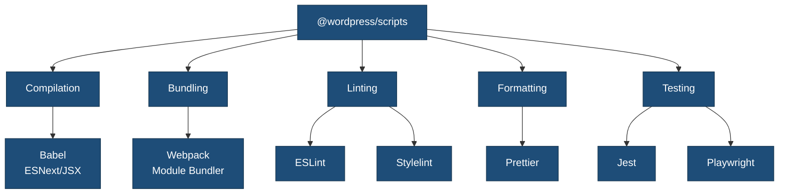
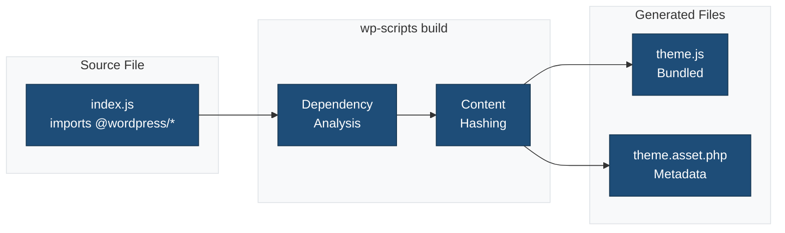

# wp-scripts Configuration Guide

This document details how `@wordpress/scripts` is configured in the {{name}} single block plugin scaffold.

## Overview

The plugin uses `@wordpress/scripts` as its build system, which provides a standardized, zero-configuration approach to WordPress block development with full support for:

✅ **Compilation**: Modern JavaScript (ESNext) and JSX to browser-compatible code via Babel
✅ **Bundling**: Multiple files combined into optimized bundles via webpack
✅ **Code Linting**: ESLint for JavaScript quality and WordPress coding standards
✅ **Code Formatting**: Prettier for consistent code styling
✅ **Sass Compilation**: `.scss` files converted to standard CSS
✅ **Code Minification**: JavaScript (Terser) and CSS (cssnano) optimization for production

## What is wp-scripts?

`@wordpress/scripts` is an official WordPress package that abstracts away complex build tool configurations. It provides:

- **Pre-configured webpack**: No need to manually set up loaders, plugins, or complex configurations
- **Babel presets**: Automatically transpiles modern JavaScript and JSX
- **Sass support**: Built-in SCSS compilation with PostCSS processing
- **Asset manifests**: Generates `.asset.php` files with dependencies and version hashes
- **Development server**: Hot module replacement for faster development
- **Testing utilities**: Jest and Playwright configurations included
- **Linting tools**: ESLint and Stylelint with WordPress standards

### wp-scripts Ecosystem



## Installation

The package is already included in `package.json`:

```json
{
  "devDependencies": {
    "@wordpress/scripts": "^31.0.0"
  }
}
```

Install all dependencies:

```bash
npm install
```

## Configuration Files

### 1. webpack.config.cjs

**Location**: `/webpack.config.cjs`

**Purpose**: Extends wp-scripts default webpack configuration with theme-specific settings.

```javascript
const defaultConfig = require( '@wordpress/scripts/config/webpack.config' );
const path = require( 'path' );

module.exports = {
 ...defaultConfig,

 // Single entry point for block registration
 entry: {
  index: './src/index.js',
 },

 // Output configuration
 output: {
  path: path.resolve( process.cwd(), 'build' ),
  filename: '[name].js',
  clean: true,
 },

 // Path aliases for cleaner imports
 resolve: {
  alias: {
   '@': path.resolve( __dirname, 'src' ),
   '@scss': path.resolve( __dirname, 'src/scss' ),
  },
 },
};
```

**Key Features**:

- Extends all wp-scripts defaults (Babel, Sass, PostCSS, etc.)
- Single entry point for block registration
- Configures path aliases for cleaner imports
- Handles additional asset types (images, fonts)
- Automatically processes block.json metadata
- Sets performance budgets for block bundles

### 2. .browserslistrc

**Location**: `/.browserslistrc`

**Purpose**: Defines target browsers for Babel transpilation and CSS autoprefixing.

```
>0.5%
last 2 versions
not dead
extends @wordpress/browserslist-config
```

**What it does**:

- Tells Babel which JavaScript features need polyfills
- Tells autoprefixer which vendor prefixes to add
- Uses WordPress recommended browser support
- Targets browsers with >0.5% market share
- Supports last 2 versions of each major browser

### 3. .postcss.config.cjs

**Location**: `/.postcss.config.cjs`

**Purpose**: Configures PostCSS plugins for CSS processing.

```javascript
module.exports = {
 plugins: [
  require( 'autoprefixer' ),    // Adds vendor prefixes
  require( 'cssnano' )( {        // Minifies CSS
   preset: 'default',
  } ),
 ],
};
```

**Plugins**:

- **autoprefixer**: Automatically adds `-webkit-`, `-moz-`, `-ms-` prefixes based on `.browserslistrc`
- **cssnano**: Minifies CSS (removes whitespace, optimizes rules, merges duplicates)

### 4. .eslint.config.cjs

**Location**: `/.eslint.config.cjs`

**Purpose**: Configures ESLint for JavaScript linting.

```javascript
module.exports = {
 extends: [ '@wordpress/eslint-plugin/recommended' ],
 env: {
  browser: true,
  es6: true,
  node: true,
  jquery: true,
 },
 globals: {
  wp: 'readonly',
  wpApiSettings: 'readonly',
  {{namespace}}: 'readonly',
 },
};
```

**Features**:

- Extends WordPress ESLint plugin (includes React, JSX, accessibility rules)
- Recognizes WordPress globals (`wp`, `wpApiSettings`)
- Supports modern JavaScript (ES6+)
- Browser and Node.js environments

### 5. .stylelint.config.cjs

**Location**: `/.stylelint.config.cjs`

**Purpose**: Configures Stylelint for CSS/Sass linting.

```javascript
module.exports = {
 extends: [ '@wordpress/stylelint-config' ],
 rules: {
  // Custom rules can be added here
 },
};
```

**Features**:

- Extends WordPress Stylelint configuration
- Enforces WordPress CSS coding standards
- Checks for syntax errors
- Validates property order and usage

## Package.json Scripts

All wp-scripts commands are defined in `package.json`:

```json
{
  "scripts": {
    "start": "wp-scripts start",
    "build": "wp-scripts build",
    "lint:js": "wp-scripts lint-js",
    "lint:js:fix": "wp-scripts lint-js --fix",
    "lint:css": "wp-scripts lint-style",
    "lint:css:fix": "wp-scripts lint-style --fix",
    "format": "wp-scripts format",
    "test:js": "wp-scripts test-unit-js"
  }
}
```

### Available Commands

| Command | What it Does |
|---------|--------------|
| `npm run start` | Starts development server with watch mode and hot reload |
| `npm run build` | Creates production-optimized bundles |
| `npm run lint:js` | Checks JavaScript files for errors and style issues |
| `npm run lint:js:fix` | Auto-fixes JavaScript linting issues |
| `npm run lint:css` | Checks CSS/Sass files for errors and style issues |
| `npm run lint:css:fix` | Auto-fixes CSS linting issues |
| `npm run format` | Formats all files with Prettier |
| `npm run test:js` | Runs JavaScript unit tests with Jest |

## How wp-scripts Works

### 1. Compilation (Babel)

**What happens**: Modern JavaScript → Browser-compatible JavaScript

**Input** (`src/{{slug}}/edit.js`):

```javascript
import { useBlockProps } from '@wordpress/block-editor';

const Edit = ({ attributes, setAttributes }) => {
 const blockProps = useBlockProps();
 return <div {...blockProps}>Block content</div>;
};

export default Edit;
```

**Output** (`build/index.js`):

```javascript
// Transpiled code with polyfills, no JSX, browser-compatible
var useState = wp.element.useState;
var MyComponent = function() {
 var _useState = useState(0),
     count = _useState[0],
     setCount = _useState[1];
 return wp.element.createElement("button", {
  onClick: function() { return setCount(count + 1); }
 }, count);
};
```

**Configured via**:

- `@wordpress/babel-preset-default` (automatic)
- `.browserslistrc` (browser targets)

### 2. Bundling (webpack)

**What happens**: Multiple files → Single optimized bundle

**Features**:

- **Module resolution**: Handles `import` and `require()` statements
- **Tree shaking**: Removes unused code
- **Code splitting**: Separates vendor code from theme code
- **Dependency management**: Automatically tracks WordPress package dependencies

**Example**:

```
src/index.js (imports from multiple files)
  ├── {{slug}}/edit.js
  ├── {{slug}}/save.js
  ├── @wordpress/blocks
  ├── @wordpress/block-editor
  └── @wordpress/i18n

                ↓ webpack bundling

build/index.js (single optimized file)
build/index.asset.php (dependency manifest)
```

### 3. Sass Compilation

**What happens**: SCSS → CSS

**Input** (`src/scss/style.scss`):

```scss
@import '@wordpress/base-styles';

.wp-block-{{namespace}}-{{slug}} {
 padding: 1rem;
 border: 1px solid #ddd;

 &__content {
  font-size: 1rem;
 }
}
```

**Output** (`build/index.css`):

```css
/* WordPress base styles included */

.wp-block-{{namespace}}-{{slug}} {
 padding: 1rem;
 border: 1px solid #ddd;
}

.wp-block-{{namespace}}-{{slug}}__content {
 font-size: 1rem;
}
```

**Processing steps**:

1. Sass compiler resolves `@import` and variables
2. PostCSS applies autoprefixer (adds vendor prefixes)
3. cssnano minifies CSS (production only)

### 4. Asset Manifests

**What happens**: Automatic dependency tracking

For each entry point, wp-scripts generates a `.asset.php` file:



**Example** (`build/index.asset.php`):

```php
<?php return array(
 'dependencies' => array(
  'wp-element',
  'wp-i18n',
  'wp-polyfill',
  'react',
  'react-dom',
 ),
 'version' => 'a1b2c3d4e5f6'
);
```

**Contents**:

- `dependencies`: Array of script handles that must be loaded first
- `version`: Content hash for cache busting (changes when file changes)

**Usage in plugin**:

WordPress automatically loads assets when registering blocks via `block.json`:

```php
// {{slug}}.php
function {{namespace}}_register_block() {
    register_block_type( __DIR__ . '/build' );
}
add_action( 'init', '{{namespace}}_register_block' );
```

The `.asset.php` file is automatically used by `register_block_type()` for dependency management and versioning.

### 5. Code Minification

**Development mode** (`npm run start`):

- No minification
- Includes source maps
- Readable code
- Fast rebuilds

**Production mode** (`npm run build`):

- JavaScript minified with Terser
  - Removes whitespace and comments
  - Shortens variable names
  - Optimizes code structure
- CSS minified with cssnano
  - Removes whitespace
  - Merges duplicate rules
  - Optimizes values

**Size comparison**:

```
Development:
  build/index.js: 120 KB
  build/index.css: 30 KB

Production:
  build/index.js: 35 KB (70% smaller)
  build/index.css: 10 KB (67% smaller)
```

## Development Workflow

### 1. Start Development Server

```bash
npm run start
```

This starts webpack in watch mode:

- Automatically recompiles when files change
- Hot module replacement (updates without full page reload)
- Fast incremental builds
- Detailed error messages
- Source maps for debugging

### 2. Make Changes

Edit files in `src/`:

```
src/
├── index.js               # Block registration entry
├── scss/
│   ├── style.scss         # Edit this
│   └── editor.scss        # Edit this
└── {{slug}}/
    ├── edit.js            # Edit this
    ├── save.js            # Edit this
    └── style.scss         # Edit this
```

### 3. Auto-compile

webpack automatically detects changes and rebuilds:

```
ℹ Compiling...
✔ Compiled successfully in 234ms

assets by path build/*.js 85 KiB
  asset index.js 85.2 KiB [emitted] (name: index)
  asset index.asset.php 234 bytes [emitted]

assets by path build/*.css 30 KiB
  asset index.css 25 KiB [emitted] (name: index)
  asset style-index.css 5 KiB [emitted]
```

### 4. Production Build

When ready to deploy:

```bash
npm run build
```

This creates optimized bundles:

- Minified code
- No source maps (or external maps)
- Tree-shaken (unused code removed)
- Optimized images and assets

## Using WordPress Packages

wp-scripts includes all `@wordpress/*` packages. Import them in your JavaScript:

```javascript
// Block registration
import { registerBlockType } from '@wordpress/blocks';

// Block editor components
import { useBlockProps, InspectorControls, RichText } from '@wordpress/block-editor';

// UI Components
import { PanelBody, TextControl, ToggleControl } from '@wordpress/components';

// Internationalization
import { __ } from '@wordpress/i18n';

// Data management
import { useSelect } from '@wordpress/data';

// Element (React)
import { useState, useEffect } from '@wordpress/element';
```

**No manual enqueuing needed** - wp-scripts automatically adds dependencies to `.asset.php`.

## Customization Examples

### Adding Another Block

**1. Create block directory**:

```bash
mkdir src/another-block
```

**2. Create block files**:

```bash
src/another-block/
├── block.json
├── edit.js
├── save.js
└── style.scss
```

**3. Register in `src/index.js`**:

```javascript
import './another-block';
```

**4. Build**:

```bash
npm run build
```

**5. WordPress automatically registers from block.json** - no manual enqueuing needed!

### Using Path Aliases

Instead of relative imports:

```javascript
import Component from '../../../components/Component';
import '../../../scss/component.scss';
```

Use path aliases (configured in `webpack.config.cjs`):

```javascript
import Component from '@/components/Component';
import '@scss/component.scss';
```

### External Dependencies

To prevent bundling large libraries (e.g., jQuery), mark them as external:

```javascript
// webpack.config.cjs
module.exports = {
 ...defaultConfig,
 externals: {
  ...defaultConfig.externals,
  jquery: 'jQuery',  // Use WordPress's jQuery
  lodash: 'lodash',  // Use WordPress's Lodash
 },
};
```

## Troubleshooting

### Build Errors

**Problem**: `Cannot find module '@wordpress/scripts'`

**Solution**:

```bash
npm install
```

---

**Problem**: `Syntax error: Unexpected token`

**Solution**: Check for invalid JavaScript syntax. Run linter:

```bash
npm run lint:js
```

---

**Problem**: `Error: Can't resolve './src/index.js'`

**Solution**: Verify file exists at specified path in `webpack.config.cjs`.

### Watch Mode Issues

**Problem**: Changes not detected

**Solution**:

1. Stop watch mode (Ctrl+C)
2. Clear build directory: `rm -rf build`
3. Restart: `npm run start`

---

**Problem**: Port already in use

**Solution**:

```bash
PORT=3000 npm run start
```

### Asset Loading Issues

**Problem**: `.asset.php` file not found

**Solution**: Run build first:

```bash
npm run build
```

---

**Problem**: Dependencies not loaded

**Solution**: The `.asset.php` is automatically used by `register_block_type()`:

```php
// {{slug}}.php
function {{namespace}}_register_block() {
    // Automatically uses build/index.asset.php
    register_block_type( __DIR__ . '/build' );
}
add_action( 'init', '{{namespace}}_register_block' );
```

## Best Practices

### 1. Always Use Build Process

Never edit files in `build/` directly - they're auto-generated and will be overwritten.

✅ **Correct**:

```
Edit: src/{{slug}}/edit.js
Build: npm run build
Result: build/index.js (auto-generated)
```

❌ **Incorrect**:

```
Edit: build/index.js (will be lost on next build)
```

### 2. Keep Dependencies Updated

Regularly update wp-scripts:

```bash
npm run packages-update
```

### 3. Use Development Mode While Coding

For faster builds and better debugging:

```bash
npm run start  # Development
# not: npm run build
```

### 4. Lint Before Committing

Set up pre-commit hooks (already configured via Husky):

```json
{
  "lint-staged": {
    "*.js": ["wp-scripts lint-js --fix", "wp-scripts format"],
    "*.scss": ["wp-scripts lint-style --fix"]
  }
}
```

### 5. Test Production Builds

Before deploying:

```bash
npm run build
# Test the production build locally
```

## Additional Resources

- [@wordpress/scripts Documentation](https://developer.wordpress.org/block-editor/reference-guides/packages/packages-scripts/)
- [Block Editor Handbook](https://developer.wordpress.org/block-editor/) - Complete block development guide
- [Block API Reference](https://developer.wordpress.org/block-editor/reference-guides/block-api/) - Block metadata and registration
- [webpack Documentation](https://webpack.js.org/)
- [Babel Documentation](https://babeljs.io/docs/)
- [WordPress JavaScript Packages](https://developer.wordpress.org/block-editor/reference-guides/packages/)

## Summary

This plugin's build process is powered by `@wordpress/scripts`, providing:

✅ Zero-configuration block development setup
✅ Full customization when needed via `webpack.config.cjs`
✅ Automatic dependency management via block.json
✅ Modern JavaScript support (ESNext, JSX, React)
✅ Sass compilation with PostCSS
✅ Code minification for production
✅ Integrated linting and formatting
✅ Hot module replacement for development
✅ Testing utilities included
✅ Block-specific optimizations

All while following WordPress block development and coding standards!
