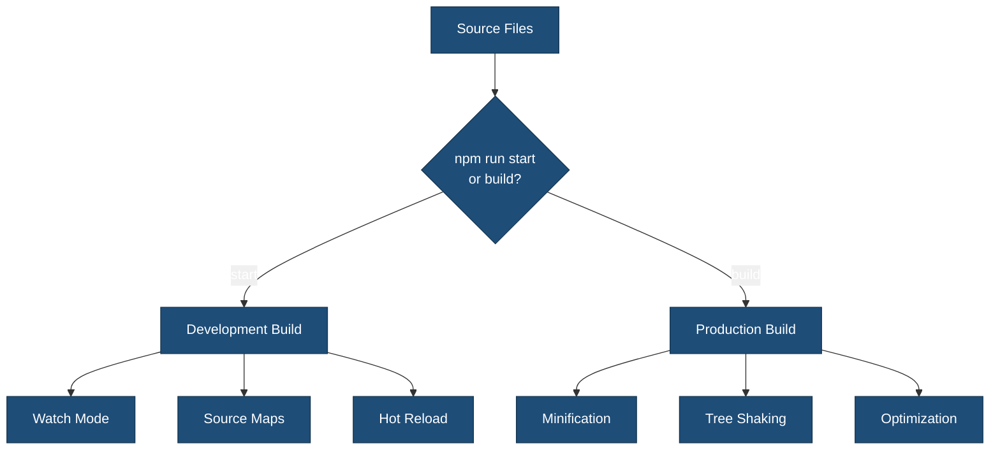

# wp-scripts Quick Reference

Quick reference guide for using `@wordpress/scripts` in the {{name}} single block plugin.

## Build Commands

```bash
# Development (watch mode, hot reload)
npm run start

# Production build (minified, optimized)
npm run build

# Create installable plugin ZIP
npm run plugin-zip
```

## What Gets Built?

### Source Files → Build Files

| Source | Output |
|--------|--------|
| `src/index.js` | `build/index.js` + `build/index.asset.php` |
| `src/scss/style.scss` | `build/index.css` |
| `src/scss/editor.scss` | `build/index.css` (merged) |
| `src/{{slug}}/block.json` | `build/{{slug}}/block.json` (copied) |
| `src/{{slug}}/style.scss` | Merged into `build/index.css` |

## Build Process Features

### Build Flow



### ✅ 1. Compilation (Babel)

Converts modern JavaScript (ESNext, JSX) to browser-compatible code.

**Example**:

```javascript
// Source (src/{{slug}}/edit.js)
const Edit = ({ attributes }) => <div {...useBlockProps()}>Content</div>;

// Output (build/index.js) - compatible with older browsers
var Edit = function(ref) {
    var attributes = ref.attributes;
    return React.createElement('div', useBlockProps(), 'Content');
};
```

**Configuration**: Automatic via `@wordpress/babel-preset-default`

### ✅ 2. Bundling (webpack)

Combines multiple files into single bundles.

**Example**:

```javascript
// src/index.js
import './{{slug}}';

// src/{{slug}}/index.js
import Edit from './edit';
import save from './save';
import './style.scss';

// All combined into → build/index.js
```

**Configuration**: `webpack.config.cjs`

### ✅ 3. Sass Compilation

Converts `.scss` to standard CSS.

**Example**:

```scss
// Source (src/scss/style.scss)
.wp-block-{{namespace}}-{{slug}} {
    padding: 1rem;
}

// Output (build/index.css)
.wp-block-{{namespace}}-{{slug}} {
    padding: 1rem;
}
```

**Configuration**: Automatic, processed with PostCSS

### ✅ 4. Code Minification

**Development** (`npm run start`):

- Readable code
- Source maps included
- No minification

**Production** (`npm run build`):

- Minified JavaScript (Terser)
- Minified CSS (cssnano)
- 60-70% size reduction

### ✅ 5. Code Linting (ESLint)

```bash
# Check JavaScript code quality
npm run lint:js

# Auto-fix issues
npm run lint:js:fix
```

**Checks for**:

- Syntax errors
- Code quality issues
- WordPress coding standards
- React best practices

**Configuration**: `.eslint.config.cjs`

### ✅ 6. Code Formatting (Prettier)

```bash
# Format all files
npm run format
```

**Formats**:

- JavaScript (.js, .jsx)
- CSS/Sass (.css, .scss)
- JSON files
- Markdown files

**Configuration**: `@wordpress/prettier-config` (automatic)

## Linting & Formatting

```bash
# JavaScript
npm run lint:js          # Check
npm run lint:js:fix      # Fix

# CSS/Sass
npm run lint:css         # Check
npm run lint:css:fix     # Fix

# PHP
npm run lint:php         # Check
npm run lint:php:fix     # Fix

# Format all
npm run format           # Prettier
```

## Testing

```bash
# All tests
npm run test

# JavaScript unit tests
npm run test:js
npm run test:js:watch    # Watch mode

# PHP tests
npm run test:php
```

## WordPress Packages

Import WordPress packages directly:

```javascript
// Block registration
import { registerBlockType } from '@wordpress/blocks';

// Block editor components
import { useBlockProps, InspectorControls, RichText } from '@wordpress/block-editor';

// UI Components
import { PanelBody, TextControl, ToggleControl } from '@wordpress/components';

// Data management
import { useSelect, useDispatch } from '@wordpress/data';

// Translations
import { __ } from '@wordpress/i18n';
const text = __( 'Hello', '{{slug}}' );

// Element (React)
import { useState, useEffect } from '@wordpress/element';
```

**No manual enqueuing needed** - dependencies automatically added to `.asset.php`.

## Asset Files (.asset.php)

Each compiled file gets an `.asset.php` file:

```php
// build/js/theme.asset.php
<?php return array(
 'dependencies' => array(
  'wp-element',
  'wp-i18n',
  'wp-polyfill',
 ),
 'version' => 'a1b2c3d4e5f6'
);
```

**Use in plugin**:

WordPress automatically uses `.asset.php` when registering blocks via `register_block_type()`:

```php
// {{slug}}.php
function {{namespace}}_register_block() {
    // Automatically uses build/index.asset.php for dependencies
    register_block_type( __DIR__ . '/build' );
}
add_action( 'init', '{{namespace}}_register_block' );
```

## Configuration Files

| File | Purpose |
|------|---------|
| `webpack.config.cjs` | webpack configuration (entry points, output, loaders) |
| `.browserslistrc` | Target browsers for Babel and autoprefixer |
| `.postcss.config.cjs` | PostCSS plugins (autoprefixer, cssnano) |
| `.eslint.config.cjs` | ESLint rules for JavaScript linting |
| `.stylelint.config.cjs` | Stylelint rules for CSS/Sass linting |
| `package.json` | npm scripts and dependencies |

## Development Workflow

### 1. Start Development

```bash
npm run start
```

### 2. Edit Files

```
src/
├── index.js            ← Edit (block registration)
├── scss/
│   ├── style.scss      ← Edit (frontend styles)
│   └── editor.scss     ← Edit (editor styles)
└── {{slug}}/
    ├── edit.js         ← Edit (edit component)
    ├── save.js         ← Edit (save component)
    └── style.scss      ← Edit (block styles)
```

### 3. Auto-compile

Files automatically rebuild on save.

### 4. Test Locally

View changes in WordPress.

### 5. Production Build

```bash
npm run build
```

## Common Tasks

### Add Another Block

1. **Create**: `src/another-block/` directory with:
   - `block.json`
   - `index.js`
   - `edit.js`
   - `save.js`
   - `style.scss`

2. **Register**: In `src/index.js`:

   ```javascript
   import './another-block';
   ```

3. **Build**: `npm run build`
4. **Auto-registered**: WordPress automatically registers from `block.json`

### Add New Sass File

1. **Create**: `src/scss/custom.scss`
2. **Import**: In `src/scss/style.scss`:

   ```scss
   @import 'custom';
   ```

3. **Build**: Automatically included in `build/index.css`

### Use Path Aliases

Instead of:

```javascript
import Component from '../../../components/Component';
```

Use:

```javascript
import Component from '@/components/Component';
import '@scss/custom.scss';
```

Configured in `webpack.config.cjs`:

```javascript
alias: {
 '@': path.resolve( __dirname, 'src' ),
 '@scss': path.resolve( __dirname, 'src/scss' ),
}
```

## Troubleshooting

### Build Fails

```bash
rm -rf node_modules build
npm install
npm run build
```

### Changes Not Detected

Restart watch mode:

```bash
# Stop (Ctrl+C)
npm run start
```

### Asset Not Found

```bash
npm run build  # Ensure build directory exists
```

### Linting Errors

```bash
npm run lint:js:fix
npm run lint:css:fix
npm run format
```

## File Size Guidelines

**Development** (`npm run start`):

```
build/index.js: ~120 KB
build/index.css: ~30 KB
```

**Production** (`npm run build`):

```
build/index.js: ~35 KB (70% smaller)
build/index.css: ~10 KB (67% smaller)
```

## Browser Support

Based on `.browserslistrc`:

- Chrome (last 2 versions)
- Firefox (last 2 versions)
- Safari (last 2 versions)
- Edge (last 2 versions)
- Browsers with >0.5% market share

Modern features are automatically transpiled/polyfilled.

## Performance Tips

### 1. Block-Specific Loading

Blocks are automatically loaded only when needed by WordPress.

```json
// block.json ensures assets only load when block is used
{
  "editorScript": "file:./index.js",
  "style": "file:./style-index.css"
}
```

### 2. Dynamic Imports

```javascript
// Instead of:
import HeavyComponent from './HeavyComponent';

// Use:
const HeavyComponent = () => import('./HeavyComponent');
```

### 3. Tree Shaking

Only import what you need:

```javascript
// ❌ Imports entire library
import _ from 'lodash';

// ✅ Imports only what's needed
import { debounce } from 'lodash';
```

### 4. External Dependencies

Mark large libraries as external (use WordPress versions):

```javascript
externals: {
 jquery: 'jQuery',
 lodash: 'lodash',
}
```

## Quick Commands Summary

```bash
# Build
npm run start              # Dev with watch
npm run build              # Production

# Quality
npm run lint               # All linting
npm run lint:js:fix        # Fix JS
npm run lint:css:fix       # Fix CSS
npm run format             # Format all

# Test
npm run test               # All tests
npm run test:js:watch      # Watch JS tests
npm run test:e2e           # E2E tests

# Internationalization
npm run makepot            # Generate .pot

# Maintenance
npm run packages-update    # Update packages
npm install                # Install deps
```

## Resources

- [wp-scripts Documentation](https://developer.wordpress.org/block-editor/reference-guides/packages/packages-scripts/)
- [Block Editor Handbook](https://developer.wordpress.org/block-editor/)
- [Block API Reference](https://developer.wordpress.org/block-editor/reference-guides/block-api/)
- [WordPress Packages](https://developer.wordpress.org/block-editor/reference-guides/packages/)

---

**Need more details?** See `docs/WP-SCRIPTS-CONFIGURATION.md` for comprehensive documentation.
