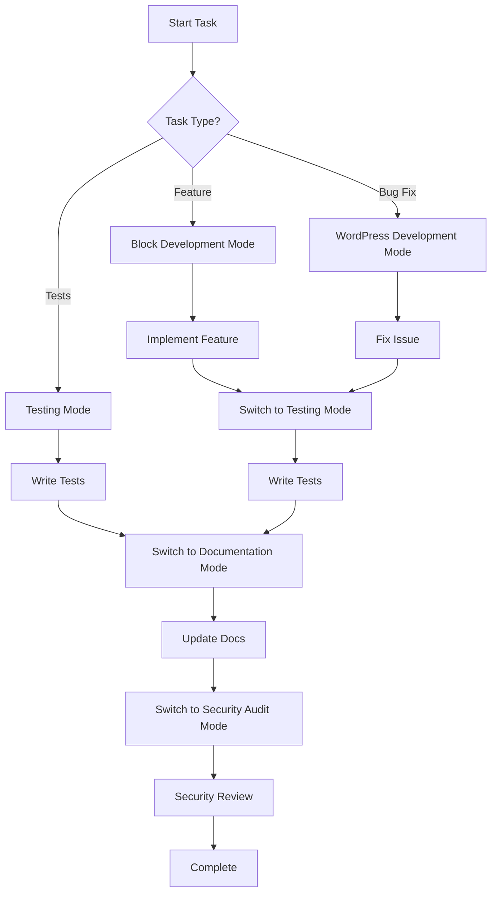
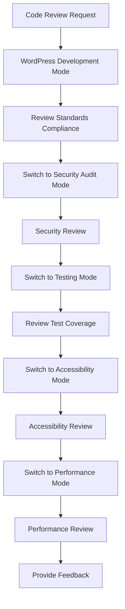

# Chat Modes for {{projectName}}

This document defines specialized chat modes and configurations for AI assistants when working with the {{projectName}} codebase. Each mode is optimized for specific types of development tasks.

## Mode Definitions

### 1. WordPress Development Mode

**Activation**: "Switch to WordPress development mode for {{projectName}}"

**Characteristics**:
- Prioritizes WordPress coding standards
- Focuses on PHP best practices
- Emphasizes security and sanitization
- References WordPress documentation
- Considers WordPress core compatibility

**Key Behaviors**:
```markdown
- Always escape output using WordPress functions (esc_html, esc_attr, esc_url)
- Use WordPress coding standards for PHP (WordPress-Core, WordPress-Extra)
- Implement proper capability checks and nonce verification
- Follow WordPress file structure and naming conventions
- Use WordPress APIs instead of direct database queries
- Consider backward compatibility with older WordPress versions
```

**Example Prompts**:
- "Add a new WordPress action hook"
- "Create a custom meta box"
- "Implement WordPress REST API endpoint"
- "Add WordPress admin settings page"

### 2. Block Development Mode

**Activation**: "Switch to block development mode for {{projectName}}"

**Characteristics**:
- Focuses on Gutenberg block APIs
- Emphasizes React and modern JavaScript
- Prioritizes block editor UX patterns
- Uses WordPress block design system
- Considers block theme compatibility

**Key Behaviors**:
```markdown
- Use @wordpress/scripts for build configuration
- Follow block.json schema for block registration
- Implement proper useBlockProps patterns
- Use WordPress design system components
- Ensure block works in all editor contexts (posts, widgets, FSE)
- Follow block editor accessibility guidelines
```

**Example Prompts**:
- "Add new block attributes"
- "Create block variation"
- "Implement block transforms"
- "Add block style variations"

### 3. Testing Mode

**Activation**: "Switch to testing mode for {{projectName}}"

**Characteristics**:
- Focuses on comprehensive test coverage
- Emphasizes test-driven development
- Uses WordPress testing frameworks
- Considers edge cases and error conditions
- Prioritizes automated testing

**Key Behaviors**:
```markdown
- Write Jest tests for JavaScript components
- Create PHPUnit tests for PHP functions
- Implement Playwright E2E tests for user workflows
- Mock WordPress APIs appropriately
- Test accessibility with screen readers
- Validate across multiple browsers and devices
```

**Example Prompts**:
- "Write tests for new component"
- "Add E2E test for block insertion"
- "Create PHP unit test for render function"
- "Test component accessibility"

### 4. Documentation Mode

**Activation**: "Switch to documentation mode for {{projectName}}"

**Characteristics**:
- Focuses on clear, comprehensive documentation
- Uses markdown with frontmatter
- Includes code examples and use cases
- Considers different audience levels
- Maintains mustache placeholder consistency

**Key Behaviors**:
```markdown
- Include frontmatter with metadata
- Use clear headings and structure
- Provide practical code examples
- Include troubleshooting sections
- Use mustache placeholders consistently
- Consider beginner and advanced users
```

**Example Prompts**:
- "Document new API endpoint"
- "Create user guide for new feature"
- "Write developer documentation"
- "Update README with new instructions"

### 5. Security Audit Mode

**Activation**: "Switch to security audit mode for {{projectName}}"

**Characteristics**:
- Prioritizes security best practices
- Focuses on vulnerability prevention
- Emphasizes input validation and output escaping
- Considers OWASP top 10 vulnerabilities
- Reviews code for security issues

**Key Behaviors**:
```markdown
- Audit all user input handling
- Verify proper output escaping
- Check for SQL injection vulnerabilities
- Review authentication and authorization
- Validate CSRF protection implementation
- Check for XSS vulnerabilities
```

**Example Prompts**:
- "Audit this function for security issues"
- "Review user input handling"
- "Check for XSS vulnerabilities"
- "Validate permission checks"

### 6. Performance Optimization Mode

**Activation**: "Switch to performance optimization mode for {{projectName}}"

**Characteristics**:
- Focuses on speed and efficiency
- Emphasizes code optimization
- Considers caching strategies
- Reviews database query efficiency
- Analyzes asset loading patterns

**Key Behaviors**:
```markdown
- Optimize database queries
- Implement proper caching strategies
- Minimize JavaScript bundle sizes
- Optimize CSS for critical path
- Review asset loading patterns
- Consider lazy loading opportunities
```

**Example Prompts**:
- "Optimize this component for performance"
- "Review database query efficiency"
- "Implement caching for expensive operations"
- "Analyze bundle size impact"

### 7. Accessibility Mode

**Activation**: "Switch to accessibility mode for {{projectName}}"

**Characteristics**:
- Prioritizes WCAG 2.1 AA compliance
- Focuses on inclusive design
- Emphasizes keyboard navigation
- Considers screen reader compatibility
- Reviews color contrast and visual design

**Key Behaviors**:
```markdown
- Ensure proper ARIA labels and roles
- Implement keyboard navigation patterns
- Verify color contrast ratios
- Test with screen readers
- Provide alternative text for images
- Ensure focus management in modals/overlays
```

**Example Prompts**:
- "Review component for accessibility"
- "Add ARIA labels to interactive elements"
- "Implement keyboard navigation"
- "Check color contrast compliance"

## Mode-Specific Workflows

### Development Workflow



### Code Review Workflow



## Context Switching Commands

### Quick Mode Switches

```bash
# Switch modes with these exact phrases:
"WordPress development mode"     # For PHP and WordPress-specific work
"Block development mode"         # For Gutenberg block development
"Testing mode"                   # For writing and running tests
"Documentation mode"             # For writing documentation
"Security audit mode"            # For security reviews
"Performance optimization mode"  # For performance improvements
"Accessibility mode"             # For accessibility compliance
```

### Mode Status Check

```bash
# Check current mode
"What mode are you in?"
"Current development mode?"

# List available modes
"Show available development modes"
"List all chat modes"
```

## Mode-Specific Guidelines

### WordPress Development Mode Guidelines

**File Patterns**:
- PHP files: Follow WordPress PHP Coding Standards
- Hook usage: Use WordPress hooks appropriately
- Database: Use WordPress database abstraction
- Caching: Implement WordPress transients

**Code Review Checklist**:
```markdown
- [ ] Proper input sanitization
- [ ] Output escaping
- [ ] Nonce verification
- [ ] Capability checks
- [ ] WordPress coding standards
- [ ] Hook usage
- [ ] Error handling
```

### Block Development Mode Guidelines

**File Patterns**:
- block.json: Complete block metadata
- edit.js: Editor component with useBlockProps
- save.js: Frontend save component
- style.scss: Block-specific styles

**Code Review Checklist**:
```markdown
- [ ] Block registration
- [ ] Proper attributes
- [ ] Editor experience
- [ ] Frontend rendering
- [ ] Responsive design
- [ ] Accessibility
```

### Testing Mode Guidelines

**Test Types**:
```javascript
// Unit tests
describe( 'Component', () => {
	test( 'renders correctly', () => {
		// Test implementation
	} );
} );

// Integration tests
describe( 'Block Integration', () => {
	test( 'saves and loads correctly', () => {
		// Test implementation
	} );
} );

// E2E tests
test( 'user can add block', async ( { page } ) => {
	// Test implementation
} );
```

**Coverage Requirements**:
- JavaScript: Minimum 80% coverage
- PHP: Minimum 70% coverage
- E2E: Critical user paths covered

## Advanced Mode Configurations

### Custom Mode Combinations

**Full Stack Development**:
```markdown
Mode: "WordPress + Block development mode"
Focus: Both PHP and JavaScript development
Considerations: Full plugin development lifecycle
```

**QA Mode**:
```markdown
Mode: "Testing + Security + Accessibility mode"
Focus: Comprehensive quality assurance
Considerations: All quality aspects covered
```

**Documentation Sprint**:
```markdown
Mode: "Documentation + Usage mode"
Focus: Comprehensive documentation creation
Considerations: User and developer documentation
```

### Mode Persistence

**Session-based**:
- Mode persists for current chat session
- Can be changed mid-conversation
- Resets when starting new conversation

**Project-based**:
- Some preferences saved per project
- File-type detection auto-switches modes
- User can override auto-detection

## Integration with Development Tools

### VSCode Integration

```json
{
	"copilot.chat.modes": {
		"wordpress": {
			"description": "WordPress development mode",
			"systemMessage": "Focus on WordPress best practices and coding standards"
		},
		"block": {
			"description": "Block development mode", 
			"systemMessage": "Focus on Gutenberg block development patterns"
		}
	}
}
```

### GitHub Copilot Chat

```markdown
<!-- WordPress mode trigger -->
@workspace /mode wordpress

<!-- Block development mode trigger -->
@workspace /mode block

<!-- Testing mode trigger -->
@workspace /mode testing
```

## Mode-Specific Prompts

### WordPress Development Mode

**Common Prompts**:
```markdown
- "Add WordPress action hook for {functionality}"
- "Create admin settings page for {feature}"
- "Implement WordPress REST API endpoint"
- "Add custom post type with meta fields"
- "Create WordPress dashboard widget"
```

### Block Development Mode

**Common Prompts**:
```markdown
- "Add new block attribute for {property}"
- "Create block variation for {use-case}"
- "Implement block transform from {source}"
- "Add block style variation for {theme}"
- "Create dynamic block with render callback"
```

### Testing Mode

**Common Prompts**:
```markdown
- "Write unit tests for {component/function}"
- "Create E2E test for {user-workflow}"
- "Add integration test for {feature}"
- "Mock WordPress API for {test-scenario}"
- "Test accessibility with {screen-reader}"
```

## Best Practices for Mode Usage

### When to Switch Modes

1. **File type changes**: Auto-switch based on file extension
2. **Task type changes**: Manual switch for different development tasks
3. **Review phases**: Switch for different review perspectives
4. **Debugging**: Switch to appropriate mode for issue type

### Mode Overlap Handling

When multiple modes apply:
1. **Primary mode**: Most relevant to current task
2. **Secondary considerations**: Apply guidelines from other relevant modes
3. **Conflict resolution**: Primary mode takes precedence
4. **Documentation**: Note which modes were considered

### Quality Assurance

All modes should consider:
- **Security implications** of changes
- **Performance impact** of new code
- **Accessibility requirements** for user-facing features
- **Testing coverage** for new functionality
- **Documentation updates** for changed behavior

---

**Note**: These chat modes are designed to improve AI assistant effectiveness when working with {{projectName}}. Adjust mode settings based on your specific development workflow and team preferences.