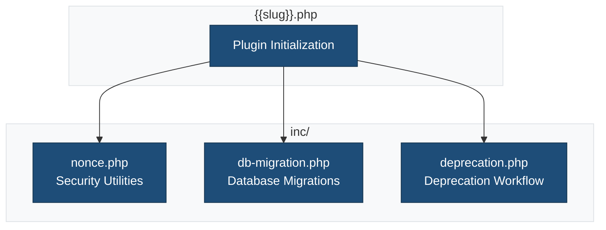

````markdown
# Plugin Includes

This directory contains PHP utility files that extend the plugin's functionality.

## Overview



## Files

### `nonce.php`

Provides secure nonce utilities for AJAX and form handling.

**Class:** `LSWP_Nonce`

**Usage:**

```php
// Create nonce instance
$nonce = new LSWP_Nonce( 'my-action' );

// Generate nonce for JavaScript
$nonce_value = $nonce->create_nonce();

// Verify in AJAX handler
if ( ! $nonce->verify_ajax() ) {
    wp_send_json_error( 'Security check failed' );
}

// Verify in form submission
if ( ! $nonce->verify_request() ) {
    wp_die( 'Security check failed' );
}

// Render nonce field in forms
$nonce->render_nonce_field();
```

**Methods:**

| Method | Description |
|--------|-------------|
| `create_nonce()` | Generate a new nonce value |
| `verify_ajax()` | Verify nonce from AJAX request |
| `verify_request()` | Verify nonce from POST request |
| `get_action()` | Get the current action name |
| `render_nonce_field()` | Output hidden nonce field |

### `db-migration.php`

Handles database schema migrations safely with version tracking.

**Class:** `LSWP_DB_Migration`

**Usage:**

```php
// Initialize migration system
$migration = new LSWP_DB_Migration( '{{slug}}' );

// Run pending migrations
$results = $migration->run_migrations();

// Check migration status
$status = $migration->get_migration_status();

// Rollback migrations
$migration->rollback( 2 ); // Rollback 2 migrations
```

**Methods:**

| Method | Description |
|--------|-------------|
| `run_migrations()` | Execute all pending migrations |
| `rollback()` | Rollback specified number of migrations |
| `get_migration_status()` | Get current migration status |
| `has_pending()` | Check for pending migrations |
| `get_current_version()` | Get current schema version |

### `deprecation.php`

Standard deprecation workflow compatible with WordPress patterns.

**Class:** `LSWP_Deprecation`

**Usage:**

```php
// Deprecate a function
LSWP_Deprecation::deprecated_function(
    'old_function_name',
    '2.0.0',
    'new_function_name'
);

// Deprecate a hook
LSWP_Deprecation::deprecated_hook(
    'old_filter_name',
    '2.0.0',
    'new_filter_name'
);

// Deprecate a function argument
LSWP_Deprecation::deprecated_argument(
    'function_name',
    '2.0.0',
    'The $old_arg parameter is deprecated.'
);

// Get deprecation log
$log = LSWP_Deprecation::get_log();
```

**Methods:**

| Method | Description |
|--------|-------------|
| `deprecated_function()` | Mark a function as deprecated |
| `deprecated_hook()` | Mark a hook as deprecated |
| `deprecated_argument()` | Mark a function argument as deprecated |
| `get_log()` | Get all deprecation notices |
| `clear_log()` | Clear the deprecation log |

## Loading Utilities

Include utilities in your main plugin file:

```php
// In {{slug}}.php
require_once plugin_dir_path( __FILE__ ) . 'inc/nonce.php';
require_once plugin_dir_path( __FILE__ ) . 'inc/db-migration.php';
require_once plugin_dir_path( __FILE__ ) . 'inc/deprecation.php';
```

## Related Documentation

- [Security Nonce Guide](../docs/SECURITY-NONCE.md)
- [Database Migration Guide](../docs/DB-MIGRATION.md)
- [Deprecation Workflow](../docs/DEPRECATION.md)
- [API Reference](../docs/API-REFERENCE.md)

````
