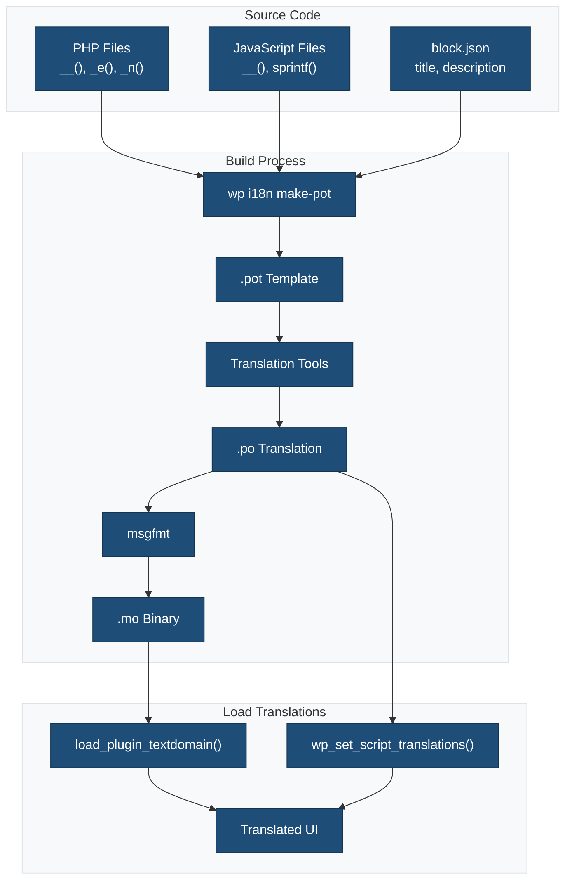
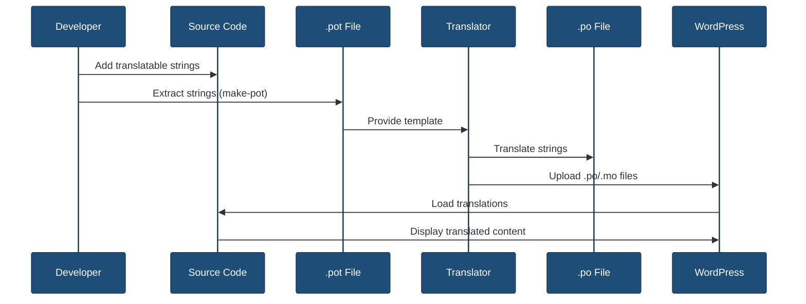

# Translation Files

This directory contains translation files for internationalization (i18n) and localization (l10n) of the plugin.

## Overview



## File Types

### `.pot` - Portable Object Template

The master translation file containing all translatable strings.

**Location:** `languages/{text-domain}.pot`

**Generated by:**

```bash
wp i18n make-pot . languages/{text-domain}.pot
```

### `.po` - Portable Object

Human-readable translation files for specific locales.

**Naming convention:** `{text-domain}-{locale}.po`

**Examples:**
- `my-plugin-es_ES.po` - Spanish (Spain)
- `my-plugin-fr_FR.po` - French (France)
- `my-plugin-de_DE.po` - German (Germany)

### `.mo` - Machine Object

Compiled binary translation files used by WordPress.

**Naming convention:** `{text-domain}-{locale}.mo`

**Generated from:** `.po` files using `msgfmt` or translation tools

### `.json` - JavaScript Translations

JSON files for JavaScript block translations.

**Naming convention:** `{text-domain}-{locale}-{handle}.json`

**Generated by:**

```bash
wp i18n make-json languages
```

## Translation Workflow



## Usage in PHP

### Text Domain

The text domain should match your plugin slug and be used consistently:

```php
load_plugin_textdomain(
    'my-plugin',
    false,
    dirname( plugin_basename( __FILE__ ) ) . '/languages'
);
```

### Translation Functions

```php
// Simple translation
__( 'Hello World', 'my-plugin' );

// Translation with echo
_e( 'Hello World', 'my-plugin' );

// Plural forms
_n(
    'One item',
    '%s items',
    $count,
    'my-plugin'
);

// Context-specific translation
_x( 'Post', 'noun', 'my-plugin' );

// Escaping
esc_html__( 'Hello World', 'my-plugin' );
esc_html_e( 'Hello World', 'my-plugin' );
```

## Usage in JavaScript

### Load Script Translations

```php
wp_set_script_translations(
    'my-block-editor-script',
    'my-plugin',
    plugin_dir_path( __FILE__ ) . 'languages'
);
```

### Translation Functions

```javascript
import { __ } from '@wordpress/i18n';

// Simple translation
__( 'Hello World', 'my-plugin' );

// Translation with sprintf
sprintf(
    __( 'Hello %s', 'my-plugin' ),
    userName
);

// Plural forms
_n(
    'One item',
    '%d items',
    count,
    'my-plugin'
);
```

## Usage in block.json

Block metadata is automatically translatable:

```json
{
    "title": "My Block",
    "description": "A custom block",
    "keywords": [ "custom", "block" ]
}
```

These strings are extracted to the `.pot` file during the build process.

## Commands

### Generate POT File

```bash
npm run make-pot
```

or

```bash
wp i18n make-pot . languages/{text-domain}.pot
```

### Generate JSON Files

```bash
npm run make-json
```

or

```bash
wp i18n make-json languages --no-purge
```

## Translation Tools

### Poedit

Download: https://poedit.net/

1. Open `.pot` file
2. Create new translation
3. Save as `.po` file
4. Compile to `.mo` (automatic)

### Loco Translate (WordPress Plugin)

Install: https://wordpress.org/plugins/loco-translate/

1. Navigate to Loco Translate
2. Select your plugin
3. Add new language
4. Translate strings in browser
5. Save `.po` and `.mo` files

### WordPress.org Translation Platform

For plugins hosted on WordPress.org:

1. Translations managed at translate.wordpress.org
2. Community translators contribute
3. Translations auto-downloaded by WordPress

## Best Practices

1. **Always use translation functions** - Never hardcode English strings
2. **Use consistent text domain** - Match your plugin slug
3. **Provide context** - Use `_x()` for ambiguous strings
4. **Keep strings simple** - Avoid concatenation
5. **Use placeholders** - `sprintf()` for variable content
6. **Extract regularly** - Update `.pot` file with each release
7. **Test translations** - Change site language to verify

## Related Documentation

- [Internationalization Guide](../docs/INTERNATIONALIZATION.md)
- [WordPress I18n Documentation](https://developer.wordpress.org/apis/internationalization/)
- [WP-CLI I18n Commands](https://developer.wordpress.org/cli/commands/i18n/)
