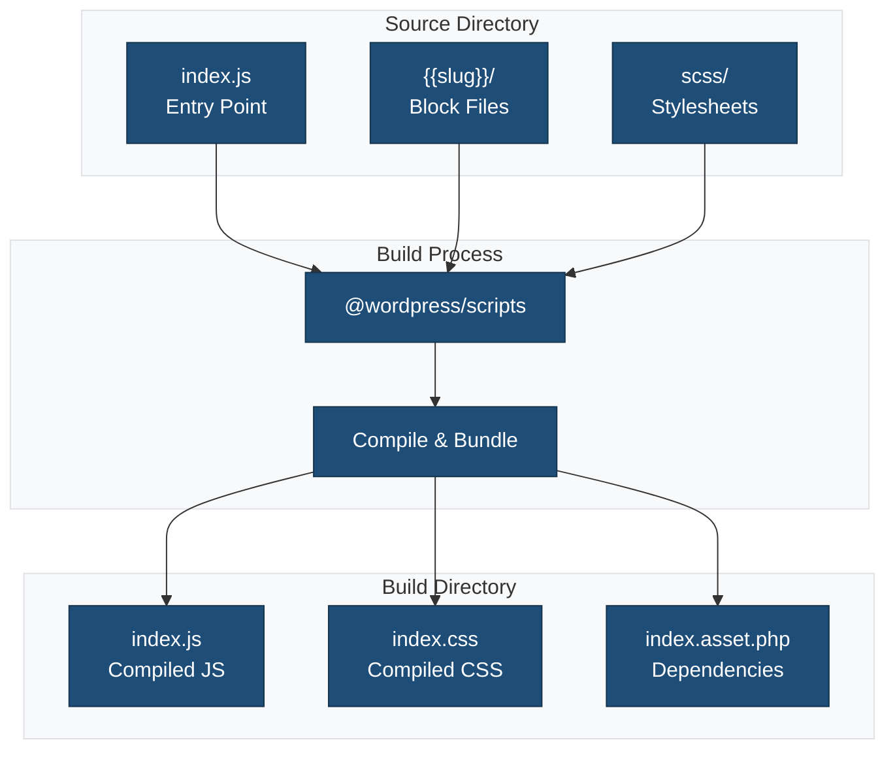
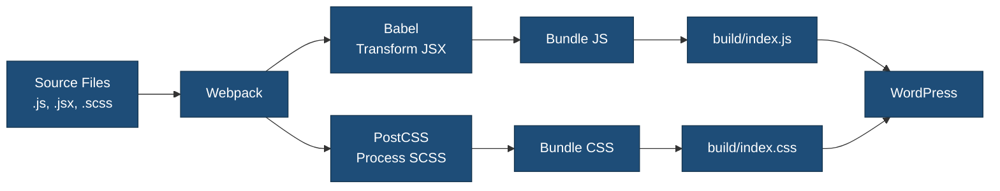

# Source Files

This directory contains the source code for the block plugin that gets compiled into the final build.

## Overview



## Directory Structure

```
src/
├── index.js              # Entry point - registers the block
├── scss/                 # Global stylesheets
│   ├── editor.scss      # Editor-only styles
│   └── style.scss       # Frontend and editor styles
└── {{slug}}/            # Block-specific files
    ├── block.json       # Block metadata
    ├── edit.js          # Edit component (editor)
    ├── save.js          # Save component (frontend)
    ├── render.php       # Dynamic rendering (optional)
    ├── view.js          # Frontend interactivity (optional)
    ├── style.scss       # Block styles
    └── editor.scss      # Block editor styles
```

## Key Files

### `index.js`

The main entry point that registers the block with WordPress.

```javascript
import { registerBlockType } from '@wordpress/blocks';
import './scss/editor.scss';
import './scss/style.scss';
import * as myBlock from './{{slug}}';

// Register the block
registerBlockType(myBlock.name, myBlock);
```

### `scss/editor.scss`

Global editor styles applied only in the block editor:

```scss
// Editor-only global styles
.wp-block {
    // Styles that affect all blocks in the editor
}
```

### `scss/style.scss`

Global styles applied to both editor and frontend:

```scss
// Frontend and editor global styles
:root {
    // CSS custom properties
    --my-plugin-primary: #1e4d78;
}
```

## Block Files (`{{slug}}/`)

See [{{slug}} README](./{{slug}}/README.md) for detailed documentation of block-specific files.

## Build Process



### Development Build

Builds files with source maps for debugging:

```bash
npm start
```

Features:

- Watch mode (auto-rebuild on changes)
- Source maps
- Fast rebuild
- Unminified code

### Production Build

Builds optimized files for production:

```bash
npm run build
```

Features:

- Minified code
- No source maps
- Tree shaking
- Optimized bundles

## File Naming Conventions

### JavaScript Files

- `*.js` - ES modules using import/export
- `edit.js` - Edit component for the block editor
- `save.js` - Save component for static rendering
- `view.js` - Frontend interactive behavior
- `index.js` - Entry points

### Style Files

- `style.scss` - Frontend and editor styles
- `editor.scss` - Editor-only styles
- Compiled to `*.css` in build directory

## Import Paths

### WordPress Packages

```javascript
import { useBlockProps } from '@wordpress/block-editor';
import { __ } from '@wordpress/i18n';
import { Button } from '@wordpress/components';
```

### Local Files

```javascript
import './style.scss';
import MyComponent from './components/MyComponent';
import { myHelper } from './utils';
```

### Block Metadata

```javascript
import metadata from './block.json';
```

## Code Splitting

The build process automatically handles code splitting:

- **index.js** - Main entry point
- **view.js** - Frontend script (loaded separately)
- **Vendor chunks** - Shared dependencies

## Asset Dependencies

The build process generates `index.asset.php` with:

```php
<?php
return array(
    'dependencies' => array(
        'wp-blocks',
        'wp-block-editor',
        'wp-i18n',
        // ... other dependencies
    ),
    'version' => '1234567890'
);
```

This file is used by WordPress to enqueue scripts with proper dependencies.

## Environment Variables

Access environment variables in your code:

```javascript
if (process.env.NODE_ENV === 'development') {
    console.log('Development mode');
}
```

## Related Documentation

- [Block Development Guide](../docs/src-folder-structure.md)
- [SCSS Directory](./scss/README.md)
- [Block Files](./{{slug}}/README.md)
- [@wordpress/scripts Documentation](https://developer.wordpress.org/block-editor/reference-guides/packages/packages-scripts/)
- [Block Editor Handbook](https://developer.wordpress.org/block-editor/)
