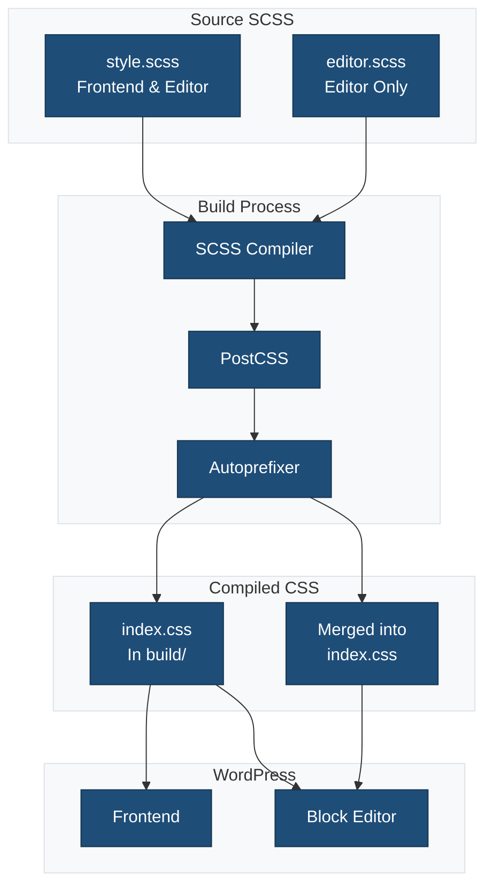
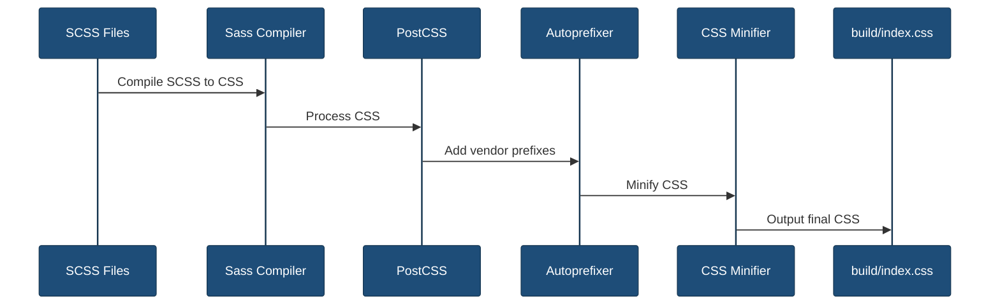

# SCSS Stylesheets

This directory contains the global SCSS stylesheets for the plugin.

## Overview



## Files

### `style.scss`

Global styles loaded on both frontend and in the block editor.

**Use for:**
- Frontend styles
- CSS custom properties (variables)
- Shared styles between frontend and editor
- Block theme overrides

**Example:**

```scss
// CSS Custom Properties
:root {
    --my-plugin-primary: #1e4d78;
    --my-plugin-secondary: #f0f0f0;
    --my-plugin-spacing: 1rem;
}

// Global frontend styles
.my-block {
    color: var(--my-plugin-primary);
    padding: var(--my-plugin-spacing);
}
```

### `editor.scss`

Styles loaded only in the block editor.

**Use for:**
- Editor UI enhancements
- Block placeholders
- Editor-specific layout
- Development helpers

**Example:**

```scss
// Editor-only enhancements
.wp-block {
    // Add visual guides in editor
    &[data-type*="my-plugin"] {
        outline: 1px dashed #ddd;
    }
}

// Block placeholder styles
.my-block-placeholder {
    padding: 2rem;
    background: #f9f9f9;
    border: 2px dashed #ccc;
}
```

## Compilation Flow



## SCSS Features

### Variables

```scss
// Local SCSS variables (compile-time)
$primary-color: #1e4d78;
$spacing-unit: 1rem;

.my-block {
    color: $primary-color;
    margin: $spacing-unit;
}
```

### Nesting

```scss
.my-block {
    padding: 1rem;

    &__title {
        font-size: 1.5rem;
        font-weight: bold;
    }

    &__content {
        margin-top: 1rem;
    }

    &.is-selected {
        outline: 2px solid blue;
    }
}
```

### Mixins

```scss
@mixin button-style($bg-color) {
    background-color: $bg-color;
    border-radius: 4px;
    padding: 0.5rem 1rem;
    cursor: pointer;

    &:hover {
        background-color: darken($bg-color, 10%);
    }
}

.my-button {
    @include button-style(#1e4d78);
}
```

### Imports

```scss
// Import partials
@import 'variables';
@import 'mixins';
@import 'components/button';
```

## PostCSS Processing

The build process applies PostCSS plugins:

### Autoprefixer

Automatically adds vendor prefixes:

```scss
// Input
.my-block {
    display: flex;
}

// Output
.my-block {
    display: -webkit-box;
    display: -ms-flexbox;
    display: flex;
}
```

### CSS Nesting

Supports native CSS nesting:

```css
.my-block {
    color: blue;

    & .inner {
        color: red;
    }
}
```

## CSS Custom Properties

Use CSS custom properties for dynamic theming:

```scss
:root {
    --my-plugin-primary: #1e4d78;
    --my-plugin-text: #333;
}

// Can be overridden by themes
.my-block {
    color: var(--my-plugin-text);
    background: var(--my-plugin-primary);
}
```

## Block Editor Considerations

### Editor Wrapper

The block editor wraps blocks in containers:

```scss
// Target the block wrapper
.wp-block-my-plugin-my-block {
    // Block wrapper styles
}

// Target the block content
.my-block {
    // Content styles
}
```

### Selected State

Style blocks when selected in the editor:

```scss
.is-selected {
    .my-block {
        outline: 2px solid var(--wp-admin-theme-color);
    }
}
```

### Placeholder State

Style empty or placeholder blocks:

```scss
.my-block {
    &.is-placeholder {
        background: #f9f9f9;
        border: 2px dashed #ccc;
        min-height: 200px;
    }
}
```

## Responsive Design

```scss
.my-block {
    padding: 1rem;

    @media (min-width: 768px) {
        padding: 2rem;
    }

    @media (min-width: 1024px) {
        padding: 3rem;
    }
}
```

## Best Practices

1. **Use CSS Custom Properties** for values that might be themed
2. **Minimize Nesting Depth** - Keep selectors shallow (max 3 levels)
3. **Follow BEM Naming** - Use block__element--modifier pattern
4. **Avoid !important** - Use specific selectors instead
5. **Mobile First** - Write base styles for mobile, use min-width media queries
6. **Scope Styles** - Prefix all selectors to avoid conflicts
7. **Use Variables** - Define colors, spacing, and breakpoints as variables

## Development Workflow

### Watch Mode

SCSS files are automatically recompiled on save:

```bash
npm start
```

### Production Build

Compile and minify for production:

```bash
npm run build
```

### Linting

Check SCSS for errors and style issues:

```bash
npm run lint:style
```

Fix auto-fixable issues:

```bash
npm run lint:style:fix
```

## Output Files

After compilation, CSS is output to:

```
build/
├── index.css           # Compiled CSS
├── index.css.map       # Source map (development only)
└── index.asset.php     # Dependencies
```

## WordPress Enqueuing

The CSS is automatically enqueued by the plugin:

```php
// Frontend and editor
wp_enqueue_style(
    'my-plugin-style',
    plugins_url('build/index.css', __FILE__)
);
```

## Related Documentation

- [Source Directory](../README.md)
- [Block Styles](../{slug}/README.md)
- [Stylelint Configuration](../../stylelint.config.js)
- [PostCSS Configuration](../../postcss.config.js)
- [Block Editor CSS](https://developer.wordpress.org/block-editor/how-to-guides/themes/theme-support/)
