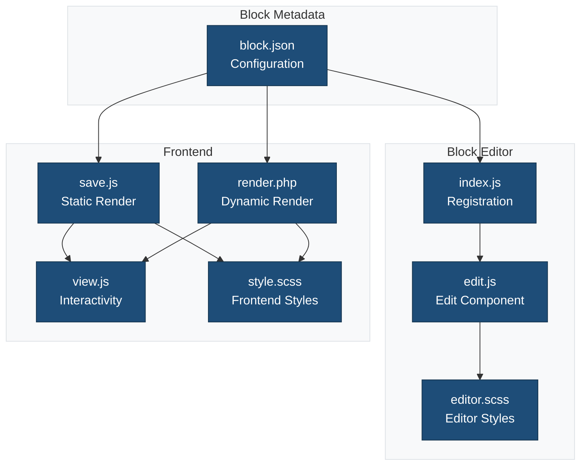
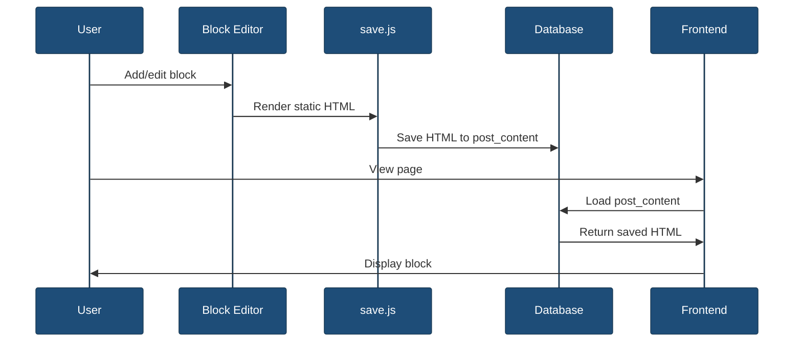
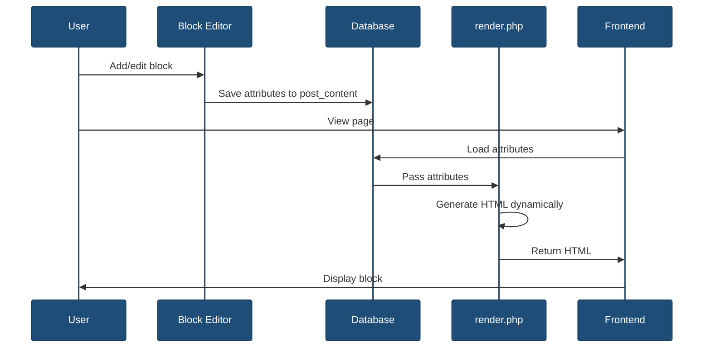

# Block Files

This directory contains all files specific to the custom block.

## Overview



## File Structure

```
{{slug}}/
├── block.json       # Block metadata and configuration
├── index.js         # Block registration
├── edit.js          # Edit component (editor interface)
├── save.js          # Save component (static output)
├── render.php       # Dynamic rendering (optional)
├── view.js          # Frontend JavaScript (optional)
├── style.scss       # Frontend and editor styles
└── editor.scss      # Editor-only styles
```

## Core Files

### `block.json`

Block metadata using [Block API version 3](https://developer.wordpress.org/block-editor/reference-guides/block-api/block-metadata/):

```json
{
    "$schema": "https://schemas.wp.org/trunk/block.json",
    "apiVersion": 3,
    "name": "my-plugin/my-block",
    "title": "My Block",
    "category": "widgets",
    "icon": "smiley",
    "description": "A custom block",
    "keywords": ["custom", "block"],
    "version": "1.0.0",
    "textdomain": "my-plugin",
    "supports": {
        "html": false,
        "align": true,
        "color": {
            "text": true,
            "background": true
        },
        "spacing": {
            "padding": true,
            "margin": true
        }
    },
    "attributes": {
        "content": {
            "type": "string",
            "default": ""
        }
    },
    "editorScript": "file:./index.js",
    "editorStyle": "file:./editor.scss",
    "style": "file:./style.scss",
    "viewScript": "file:./view.js",
    "render": "file:./render.php"
}
```

**Key Properties:**

| Property | Description |
|----------|-------------|
| `apiVersion` | Block API version (2 or 3) |
| `name` | Unique block identifier (namespace/block-name) |
| `title` | Display name in inserter |
| `category` | Block category (text, media, design, widgets, theme, embed) |
| `attributes` | Block data structure |
| `supports` | Feature flags (align, color, spacing, etc.) |
| `editorScript` | JavaScript for editor |
| `editorStyle` | CSS for editor only |
| `style` | CSS for frontend and editor |
| `viewScript` | JavaScript for frontend |
| `render` | PHP file for dynamic rendering |

### `index.js`

Registers the block with WordPress:

```javascript
import { registerBlockType } from '@wordpress/blocks';
import Edit from './edit';
import save from './save';
import metadata from './block.json';
import './style.scss';
import './editor.scss';

registerBlockType(metadata.name, {
    ...metadata,
    edit: Edit,
    save,
});
```

**Exports:**

```javascript
export { metadata as default, Edit as edit, save };
```

### `edit.js`

React component for the block editor interface:

```javascript
import { useBlockProps, InspectorControls } from '@wordpress/block-editor';
import { PanelBody, TextControl } from '@wordpress/components';
import { __ } from '@wordpress/i18n';

export default function Edit({ attributes, setAttributes }) {
    const { content } = attributes;
    const blockProps = useBlockProps();

    return (
        <>
            <InspectorControls>
                <PanelBody title={__('Settings', 'my-plugin')}>
                    <TextControl
                        label={__('Content', 'my-plugin')}
                        value={content}
                        onChange={(value) => setAttributes({ content: value })}
                    />
                </PanelBody>
            </InspectorControls>
            <div {...blockProps}>
                <p>{content || __('Enter content...', 'my-plugin')}</p>
            </div>
        </>
    );
}
```

**Key Concepts:**
- `useBlockProps()` - Required wrapper props
- `InspectorControls` - Sidebar settings panel
- `setAttributes()` - Update block attributes
- `__()` - Translation function

### `save.js`

Static output saved to post content:

```javascript
import { useBlockProps } from '@wordpress/block-editor';

export default function save({ attributes }) {
    const { content } = attributes;
    const blockProps = useBlockProps.save();

    return (
        <div {...blockProps}>
            <p>{content}</p>
        </div>
    );
}
```

**When to use:**
- Static blocks (no server-side data)
- Content that doesn't change dynamically
- Better performance (no PHP execution)

**When NOT to use:**
- Dynamic content (user data, posts, etc.)
- Content that needs server-side processing
- Use `render.php` instead for dynamic blocks

### `render.php`

Server-side dynamic rendering:

```php
<?php
/**
 * Dynamic block rendering
 *
 * @param array    $attributes Block attributes
 * @param string   $content    Block content
 * @param WP_Block $block      Block instance
 */

$content = $attributes['content'] ?? '';
$wrapper_attributes = get_block_wrapper_attributes();
?>

<div <?php echo $wrapper_attributes; ?>>
    <p><?php echo esc_html($content); ?></p>
</div>
```

**Use for:**
- Dynamic content (posts, users, custom queries)
- Server-side data processing
- Content that changes based on context
- Security-sensitive content

**Important:**
- If `render.php` exists, `save.js` returns `null`
- Use `get_block_wrapper_attributes()` for wrapper
- Always escape output for security

### `view.js`

Frontend JavaScript for interactivity:

```javascript
document.addEventListener('DOMContentLoaded', () => {
    const blocks = document.querySelectorAll('.wp-block-my-plugin-my-block');

    blocks.forEach((block) => {
        // Add frontend interactivity
        block.addEventListener('click', (e) => {
            console.log('Block clicked', e.target);
        });
    });
});
```

**Use for:**
- Frontend interactions (clicks, animations)
- Client-side state management
- Dynamic behavior without page reload
- Progressive enhancement

**Note:** Only loaded on frontend, not in editor

## Stylesheets

### `style.scss`

Styles loaded on both frontend and in editor:

```scss
.wp-block-my-plugin-my-block {
    padding: 1rem;
    border: 1px solid #ddd;

    p {
        margin: 0;
        font-size: 1rem;
    }
}
```

### `editor.scss`

Styles loaded only in the block editor:

```scss
.wp-block-my-plugin-my-block {
    // Editor-specific styles
    &.is-selected {
        outline: 2px solid var(--wp-admin-theme-color);
    }
}
```

## Block Rendering Flow

### Static Blocks (save.js)



### Dynamic Blocks (render.php)



## Block Attributes

Attributes define the block's data structure:

```json
{
    "attributes": {
        "content": {
            "type": "string",
            "default": ""
        },
        "alignment": {
            "type": "string",
            "default": "left"
        },
        "showTitle": {
            "type": "boolean",
            "default": true
        },
        "count": {
            "type": "number",
            "default": 5
        }
    }
}
```

**Attribute Types:**
- `string` - Text values
- `boolean` - True/false
- `number` - Numeric values
- `integer` - Whole numbers
- `array` - Lists
- `object` - Complex data structures

## Block Supports

Enable features for your block:

```json
{
    "supports": {
        "align": ["wide", "full"],
        "anchor": true,
        "color": {
            "text": true,
            "background": true,
            "link": true
        },
        "spacing": {
            "padding": true,
            "margin": true
        },
        "typography": {
            "fontSize": true,
            "lineHeight": true
        }
    }
}
```

## Development Workflow

### Edit in Editor

1. Start development server:
   ```bash
   npm start
   ```

2. Make changes to block files

3. Refresh editor to see changes

### Test on Frontend

1. Insert block in editor
2. Publish/update post
3. View on frontend
4. Check browser console for view.js output

### Build for Production

```bash
npm run build
```

## Related Documentation

- [Block Editor Handbook](https://developer.wordpress.org/block-editor/)
- [Block API Reference](https://developer.wordpress.org/block-editor/reference-guides/block-api/)
- [block.json Schema](https://developer.wordpress.org/block-editor/reference-guides/block-api/block-metadata/)
- [Source Directory](../README.md)
- [SCSS Styles](../scss/README.md)
