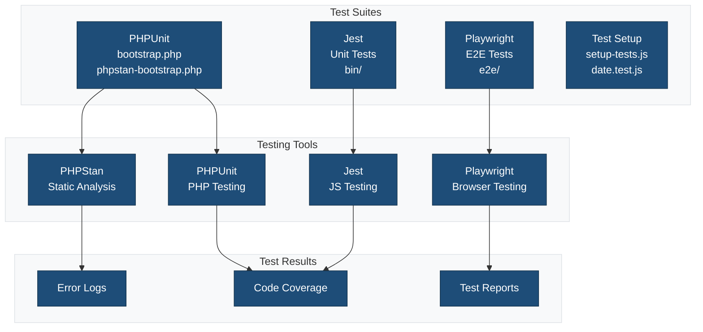
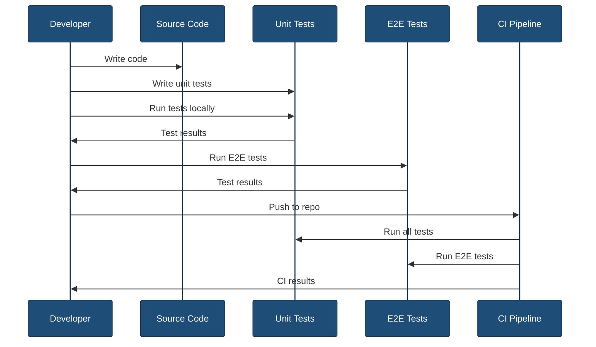

# Tests

This directory contains all test files for the single block plugin.

## Overview



## Directory Structure

```
tests/
├── bootstrap.php              # PHPUnit bootstrap
├── phpstan-bootstrap.php      # PHPStan bootstrap
├── setup-tests.js            # Jest setup
├── date.js                   # Date utilities
├── date.test.js              # Date utility tests
├── bin/                      # Script tests
│   ├── generate-single-block-plugin.test.js
│   └── update-version.test.js
└── e2e/                      # End-to-end tests
    └── block.spec.js
```

## Test Types

### PHPUnit Tests

Unit tests for PHP code using PHPUnit.

**Location:** Root `tests/` directory and subdirectories

**Configuration:** [`phpunit.xml`](../phpunit.xml)

**Run tests:**

```bash
npm run test:php
```

**Bootstrap file:** `bootstrap.php`

```php
<?php
/**
 * PHPUnit bootstrap file
 */

// Load WordPress test environment
require_once dirname(__FILE__) . '/../vendor/autoload.php';

// Set up WordPress testing environment
define('WP_TESTS_PHPUNIT_POLYFILLS_PATH', 
    dirname(__FILE__) . '/../vendor/yoast/phpunit-polyfills');

// Load WordPress test case
require_once getenv('WP_TESTS_DIR') . '/includes/bootstrap.php';
```

### Jest Tests

Unit tests for JavaScript code using Jest.

**Location:** `tests/bin/`, root test files

**Configuration:** [`jest.config.js`](../jest.config.js)

**Run tests:**

```bash
npm run test:js
```

**Setup file:** `setup-tests.js`

```javascript
// Jest setup
global.wp = {
    blocks: {},
    data: {},
    element: require('@wordpress/element'),
};
```

### Playwright Tests

End-to-end tests for block functionality in a real browser.

**Location:** `tests/e2e/`

**Configuration:** [`playwright.config.js`](../playwright.config.js)

**Run tests:**

```bash
npm run test:e2e
```

### PHPStan

Static analysis for PHP code.

**Configuration:** [`phpstan.neon`](../phpstan.neon)

**Run analysis:**

```bash
npm run test:phpstan
```

## Test Flow



## Running Tests

### All Tests

Run all test suites:

```bash
npm test
```

### Individual Test Suites

```bash
# PHPUnit tests
npm run test:php

# Jest tests
npm run test:js

# Playwright tests
npm run test:e2e

# PHPStan analysis
npm run test:phpstan
```

### Watch Mode

Run tests in watch mode for development:

```bash
npm run test:js -- --watch
```

### Coverage

Generate code coverage reports:

```bash
npm run test:js -- --coverage
```

## Test Files

### `bootstrap.php`

Bootstraps the PHPUnit test environment:

- Loads WordPress test suite
- Sets up database
- Initializes plugin
- Configures test constants

### `phpstan-bootstrap.php`

Bootstraps PHPStan static analysis:

- Loads WordPress stubs
- Defines WordPress functions
- Sets up autoloading

### `setup-tests.js`

Configures Jest testing environment:

- Mocks WordPress globals
- Sets up DOM environment
- Configures test utilities

### `date.js` & `date.test.js`

Date utility functions and tests:

```javascript
// date.js
export function formatDate(date) {
    return date.toISOString().split('T')[0];
}

// date.test.js
import { formatDate } from './date';

test('formats date correctly', () => {
    const date = new Date('2024-01-15');
    expect(formatDate(date)).toBe('2024-01-15');
});
```

## Writing Tests

### PHP Test Example

```php
<?php
class Test_Block extends WP_UnitTestCase {
    public function test_block_registration() {
        $block_types = WP_Block_Type_Registry::get_instance()->get_all_registered();
        $this->assertArrayHasKey('my-plugin/my-block', $block_types);
    }
}
```

### Jest Test Example

```javascript
import { render } from '@testing-library/react';
import Edit from '../src/{{slug}}/edit';

describe('Edit component', () => {
    it('renders without crashing', () => {
        const { container } = render(
            <Edit attributes={{}} setAttributes={jest.fn()} />
        );
        expect(container).toBeInTheDocument();
    });
});
```

### Playwright Test Example

```javascript
import { test, expect } from '@playwright/test';

test('block can be inserted', async ({ page }) => {
    await page.goto('/wp-admin/post-new.php');
    await page.click('[aria-label="Add block"]');
    await page.fill('[placeholder="Search"]', 'My Block');
    await page.click('button:has-text("My Block")');
    await expect(page.locator('.wp-block-my-plugin-my-block')).toBeVisible();
});
```

## Best Practices

1. **Write tests first** - Test-driven development (TDD)
2. **Test one thing** - Each test should verify one behavior
3. **Use descriptive names** - Test names should explain what they test
4. **Keep tests isolated** - Tests shouldn't depend on each other
5. **Mock external dependencies** - Use mocks for APIs, databases
6. **Test edge cases** - Test boundary conditions and errors
7. **Maintain tests** - Update tests when code changes
8. **Run tests often** - Run tests before committing

## Continuous Integration

Tests run automatically in CI/CD pipelines:

```yaml
# Example GitHub Actions workflow
- name: Run PHPUnit tests
  run: npm run test:php

- name: Run Jest tests
  run: npm run test:js

- name: Run Playwright tests
  run: npm run test:e2e
```

## Debugging Tests

### Jest

```bash
# Run specific test file
npm run test:js -- path/to/test.js

# Run tests matching pattern
npm run test:js -- --testNamePattern="block registration"

# Debug with Node inspector
node --inspect-brk node_modules/.bin/jest
```

### Playwright

```bash
# Run in headed mode (see browser)
npm run test:e2e -- --headed

# Debug mode
npm run test:e2e -- --debug

# Run specific test
npm run test:e2e -- tests/e2e/block.spec.js
```

## Related Documentation

- [Script Tests](./bin/README.md)
- [E2E Tests](./e2e/README.md)
- [PHPUnit Configuration](../phpunit.xml)
- [Jest Configuration](../jest.config.js)
- [Playwright Configuration](../playwright.config.js)
- [PHPStan Configuration](../phpstan.neon)
