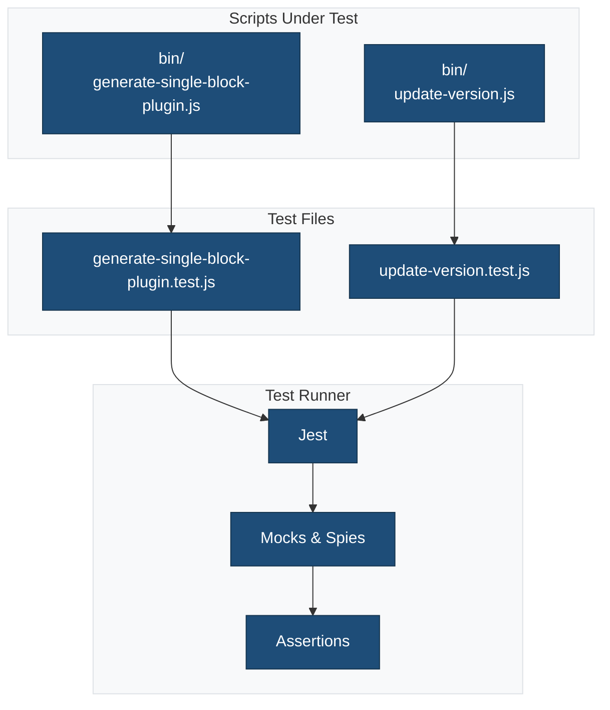
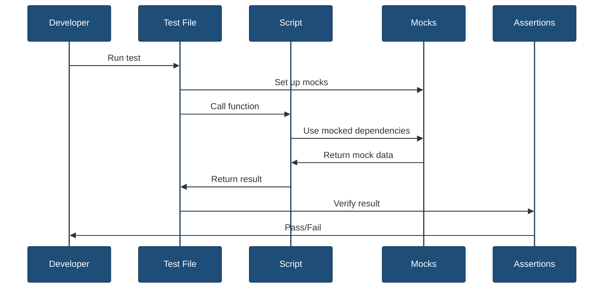

# Script Tests

This directory contains unit tests for the build and utility scripts.

## Overview



## Test Files

### `generate-single-block-plugin.test.js`

Tests the plugin generation script functionality.

**Tests:**
- File template replacement
- Directory structure creation
- Package.json updates
- Composer.json updates
- Error handling
- CLI argument parsing

**Example test:**

```javascript
import { describe, test, expect, jest } from '@jest/globals';
import fs from 'fs';
import path from 'path';

// Mock fs module
jest.mock('fs');

describe('generate-single-block-plugin', () => {
    test('replaces template variables in files', () => {
        const template = 'Plugin Name: {{name}}';
        const result = replaceTemplateVars(template, {
            name: 'My Block'
        });
        expect(result).toBe('Plugin Name: My Block');
    });

    test('creates plugin directory structure', () => {
        const slug = 'my-block';
        createPluginStructure(slug);
        
        expect(fs.mkdirSync).toHaveBeenCalledWith(
            expect.stringContaining(slug),
            expect.any(Object)
        );
    });

    test('throws error for invalid slug', () => {
        expect(() => {
            validateSlug('Invalid Slug');
        }).toThrow('Slug must be kebab-case');
    });
});
```

**Coverage areas:**
- Template variable replacement
- File system operations
- JSON parsing/stringifying
- Input validation
- Error handling

### `update-version.test.js`

Tests the version update script functionality.

**Tests:**
- Version number validation
- File content updates
- Semantic versioning
- Multiple file updates
- Error handling

**Example test:**

```javascript
import { describe, test, expect } from '@jest/globals';

describe('update-version', () => {
    test('validates semantic version format', () => {
        expect(isValidVersion('1.2.3')).toBe(true);
        expect(isValidVersion('1.0.0-alpha')).toBe(true);
        expect(isValidVersion('invalid')).toBe(false);
    });

    test('updates version in package.json', () => {
        const content = '{"version": "1.0.0"}';
        const updated = updatePackageVersion(content, '1.1.0');
        const parsed = JSON.parse(updated);
        expect(parsed.version).toBe('1.1.0');
    });

    test('updates version in plugin header', () => {
        const content = '* Version: 1.0.0';
        const updated = updatePluginHeader(content, '1.1.0');
        expect(updated).toContain('* Version: 1.1.0');
    });

    test('handles missing version gracefully', () => {
        const content = '{"name": "plugin"}';
        expect(() => {
            updatePackageVersion(content, '1.0.0');
        }).not.toThrow();
    });
});
```

**Coverage areas:**
- Version validation
- Regex pattern matching
- File content manipulation
- JSON updates
- Plugin header updates

## Test Patterns

### Mocking File System

```javascript
import fs from 'fs';
import { jest } from '@jest/globals';

jest.mock('fs');

beforeEach(() => {
    fs.readFileSync.mockReturnValue('mock content');
    fs.writeFileSync.mockImplementation(() => {});
    fs.existsSync.mockReturnValue(true);
});

afterEach(() => {
    jest.clearAllMocks();
});
```

### Testing CLI Arguments

```javascript
test('parses CLI arguments', () => {
    const args = ['--slug', 'my-block', '--name', 'My Block'];
    const parsed = parseArgs(args);
    
    expect(parsed.slug).toBe('my-block');
    expect(parsed.name).toBe('My Block');
});
```

### Testing Error Handling

```javascript
test('handles missing required arguments', () => {
    const args = ['--name', 'My Block']; // Missing slug
    
    expect(() => {
        parseArgs(args);
    }).toThrow('Missing required argument: slug');
});
```

### Testing Async Operations

```javascript
test('handles async file operations', async () => {
    const promise = readFileAsync('test.txt');
    await expect(promise).resolves.toBe('file content');
});
```

## Running Tests

### All Script Tests

```bash
npm run test:js -- tests/bin
```

### Specific Test File

```bash
npm run test:js -- tests/bin/generate-single-block-plugin.test.js
```

### Watch Mode

```bash
npm run test:js -- tests/bin --watch
```

### Coverage Report

```bash
npm run test:js -- tests/bin --coverage
```

## Test Flow



## Debugging Tests

### Debug Specific Test

```bash
node --inspect-brk node_modules/.bin/jest tests/bin/generate-single-block-plugin.test.js
```

### Add Debug Output

```javascript
test('debugs value', () => {
    const result = myFunction();
    console.log('Result:', result);
    expect(result).toBe(expected);
});
```

### Use Jest Debugger

1. Add `debugger;` statement in test
2. Run with `--inspect-brk` flag
3. Open Chrome DevTools
4. Navigate to `chrome://inspect`

## Best Practices

1. **Test behavior, not implementation** - Focus on what the function does, not how
2. **Use descriptive test names** - Clearly state what is being tested
3. **One assertion per test** - Keep tests focused and simple
4. **Mock external dependencies** - Don't test file system directly
5. **Test edge cases** - Empty strings, null values, invalid input
6. **Clean up after tests** - Reset mocks and state
7. **Keep tests fast** - Avoid slow operations
8. **Make tests deterministic** - No random values or dates

## Common Test Utilities

### Setup and Teardown

```javascript
beforeAll(() => {
    // Runs once before all tests
});

afterAll(() => {
    // Runs once after all tests
});

beforeEach(() => {
    // Runs before each test
    jest.clearAllMocks();
});

afterEach(() => {
    // Runs after each test
});
```

### Matchers

```javascript
// Equality
expect(value).toBe(expected);
expect(value).toEqual(expected);

// Truthiness
expect(value).toBeTruthy();
expect(value).toBeFalsy();

// Numbers
expect(value).toBeGreaterThan(3);
expect(value).toBeLessThan(5);

// Strings
expect(string).toMatch(/pattern/);
expect(string).toContain('substring');

// Arrays
expect(array).toContain(item);
expect(array).toHaveLength(3);

// Objects
expect(object).toHaveProperty('key');

// Errors
expect(() => fn()).toThrow();
expect(() => fn()).toThrow('error message');
```

## Coverage Reports

View coverage report after running tests:

```bash
npm run test:js -- tests/bin --coverage
```

Coverage is reported for:
- Statement coverage
- Branch coverage
- Function coverage
- Line coverage

Reports are generated in `coverage/` directory.

## Related Documentation

- [Tests Overview](../README.md)
- [Jest Configuration](../../jest.config.js)
- [Generator Script](../../bin/generate-single-block-plugin.js)
- [Update Version Script](../../bin/update-version.js)
- [Jest Documentation](https://jestjs.io/docs/getting-started)
