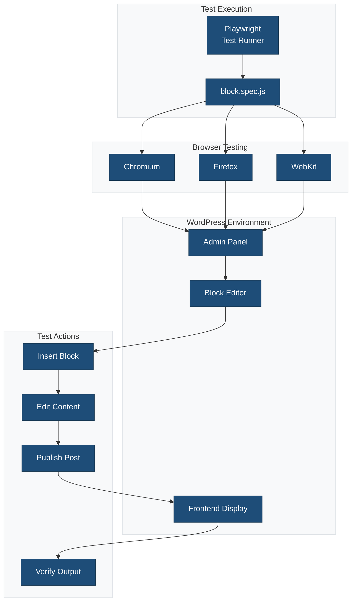
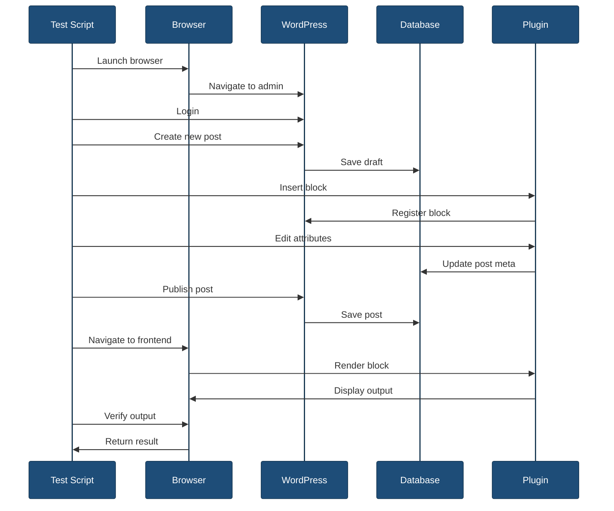
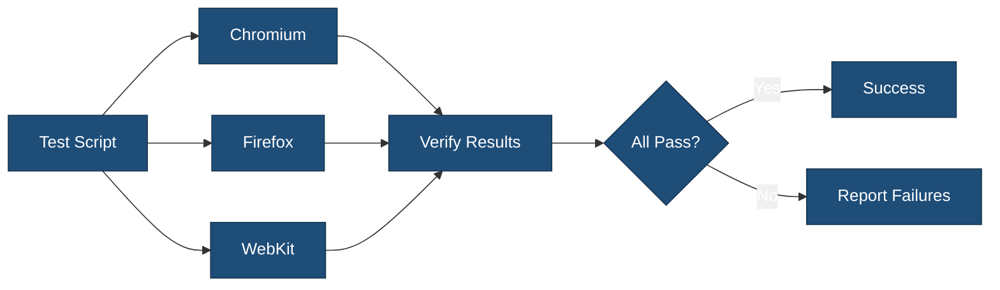

# End-to-End Tests

This directory contains end-to-end (E2E) tests using Playwright to test the block in a real WordPress environment.

## Overview



## Test File

### `block.spec.js`

Tests the block functionality in a real browser environment.

**Test scenarios:**

- Block registration
- Block insertion
- Block editing
- Attribute updates
- Frontend rendering
- Settings panel
- Toolbar controls

**Example test:**

```javascript
import { test, expect } from '@playwright/test';
import { admin, editor } from '@wordpress/e2e-test-utils-playwright';

test.describe('My Block', () => {
    test.beforeEach(async ({ page }) => {
        await admin.createNewPost();
    });

    test('block can be inserted', async ({ page }) => {
        // Open inserter
        await page.click('[aria-label="Add block"]');

        // Search for block
        await page.fill('[placeholder="Search"]', 'My Block');

        // Insert block
        await page.click('button:has-text("My Block")');

        // Verify block exists
        const block = page.locator('.wp-block-my-plugin-my-block');
        await expect(block).toBeVisible();
    });

    test('block attributes can be edited', async ({ page }) => {
        // Insert block
        await editor.insertBlock({ name: 'my-plugin/my-block' });

        // Open settings sidebar
        await page.click('[aria-label="Settings"]');

        // Edit attribute
        await page.fill('input[aria-label="Content"]', 'Test content');

        // Verify change
        const block = page.locator('.wp-block-my-plugin-my-block');
        await expect(block).toContainText('Test content');
    });

    test('block renders on frontend', async ({ page }) => {
        // Insert and configure block
        await editor.insertBlock({ name: 'my-plugin/my-block' });
        await page.fill('.wp-block-my-plugin-my-block input', 'Frontend test');

        // Publish post
        await page.click('button:has-text("Publish")');
        await page.click('button:has-text("Publish")'); // Confirm

        // View post
        await page.click('a:has-text("View Post")');

        // Verify frontend rendering
        const block = page.locator('.wp-block-my-plugin-my-block');
        await expect(block).toContainText('Frontend test');
    });

    test('block can be deleted', async ({ page }) => {
        // Insert block
        await editor.insertBlock({ name: 'my-plugin/my-block' });

        // Select block
        await page.click('.wp-block-my-plugin-my-block');

        // Delete block
        await page.keyboard.press('Backspace');

        // Verify deletion
        const block = page.locator('.wp-block-my-plugin-my-block');
        await expect(block).not.toBeVisible();
    });
});
```

## Test Flow



## Running E2E Tests

### All Tests

```bash
npm run test:e2e
```

### Headed Mode (Visible Browser)

```bash
npm run test:e2e -- --headed
```

### Debug Mode

```bash
npm run test:e2e -- --debug
```

### Specific Browser

```bash
# Chromium only
npm run test:e2e -- --project=chromium

# Firefox only
npm run test:e2e -- --project=firefox

# WebKit only
npm run test:e2e -- --project=webkit
```

### Specific Test File

```bash
npm run test:e2e -- tests/e2e/block.spec.js
```

### Specific Test

```bash
npm run test:e2e -- --grep "block can be inserted"
```

## Test Utilities

### WordPress E2E Utils

Playwright provides WordPress-specific utilities:

```javascript
import {
    admin,
    editor,
    page
} from '@wordpress/e2e-test-utils-playwright';

// Admin utilities
await admin.createNewPost();
await admin.visitAdminPage('plugins.php');

// Editor utilities
await editor.insertBlock({ name: 'core/paragraph' });
await editor.publishPost();

// Page utilities
await page.waitForSelector('.block-editor');
```

### Common Actions

```javascript
// Wait for element
await page.waitForSelector('.my-block');

// Click element
await page.click('button:has-text("Click me")');

// Fill input
await page.fill('input[name="title"]', 'Test Title');

// Select option
await page.selectOption('select', 'option-value');

// Keyboard input
await page.keyboard.press('Enter');
await page.keyboard.type('Hello World');

// Screenshot
await page.screenshot({ path: 'screenshot.png' });

// Network wait
await page.waitForResponse('**/wp-json/**');
```

## Assertions

### Element Visibility

```javascript
await expect(element).toBeVisible();
await expect(element).toBeHidden();
await expect(element).not.toBeVisible();
```

### Text Content

```javascript
await expect(element).toHaveText('Expected text');
await expect(element).toContainText('partial text');
```

### Attributes

```javascript
await expect(element).toHaveAttribute('href', '/link');
await expect(element).toHaveClass('my-class');
```

### Count

```javascript
await expect(elements).toHaveCount(3);
```

### URL

```javascript
await expect(page).toHaveURL(/\/post\/\d+/);
await expect(page).toHaveTitle('My Page Title');
```

## Test Configuration

Tests are configured in [`playwright.config.js`](../../playwright.config.js):

```javascript
export default {
    testDir: './tests/e2e',
    timeout: 30000,
    use: {
        baseURL: 'http://localhost:8888',
        screenshot: 'only-on-failure',
        video: 'retain-on-failure',
    },
    projects: [
        {
            name: 'chromium',
            use: { ...devices['Desktop Chrome'] },
        },
        {
            name: 'firefox',
            use: { ...devices['Desktop Firefox'] },
        },
        {
            name: 'webkit',
            use: { ...devices['Desktop Safari'] },
        },
    ],
};
```

## Environment Setup

### Local WordPress

E2E tests require a running WordPress instance:

```bash
# Using wp-env
npm run wp-env start

# Using Docker
docker-compose up -d
```

### Configuration

Set WordPress URL in environment:

```bash
export WP_BASE_URL=http://localhost:8888
```

Or in `.env` file:

```
WP_BASE_URL=http://localhost:8888
WP_USERNAME=admin
WP_PASSWORD=password
```

## Browser Testing



Tests run in parallel across multiple browsers:

- **Chromium** - Chrome, Edge
- **Firefox** - Mozilla Firefox
- **WebKit** - Safari

## Debugging Tests

### Visual Debugging

```bash
# Headed mode - see browser
npm run test:e2e -- --headed

# Debug mode - pause execution
npm run test:e2e -- --debug

# Slow motion - slow down actions
npm run test:e2e -- --headed --slow-mo=1000
```

### Screenshots and Videos

Failed tests automatically capture:

- Screenshots
- Videos
- Trace files

Located in `test-results/` directory.

### Playwright Inspector

```bash
npm run test:e2e -- --debug
```

Features:

- Step through tests
- Inspect elements
- View console logs
- Edit locators

## Best Practices

1. **Use data-testid attributes** for stable selectors
2. **Wait for elements** before interacting
3. **Test user flows** not implementation details
4. **Keep tests independent** - each test should work alone
5. **Clean up after tests** - delete created content
6. **Use meaningful test names** - describe what is tested
7. **Test critical paths** - focus on important user journeys
8. **Verify both editor and frontend** - test full flow

## Common Patterns

### Test Block Insertion

```javascript
test('insert block', async ({ page }) => {
    await admin.createNewPost();
    await editor.insertBlock({ name: 'my-plugin/my-block' });
    await expect(page.locator('[data-type="my-plugin/my-block"]')).toBeVisible();
});
```

### Test Block Editing

```javascript
test('edit block', async ({ page }) => {
    await admin.createNewPost();
    await editor.insertBlock({ name: 'my-plugin/my-block' });
    await page.fill('.block-editor input', 'New content');
    await expect(page.locator('.block-editor')).toContainText('New content');
});
```

### Test Frontend Output

```javascript
test('frontend display', async ({ page }) => {
    await admin.createNewPost();
    await editor.insertBlock({ name: 'my-plugin/my-block' });
    await editor.publishPost();

    const url = await page.locator('.post-publish-panel__postpublish-post-address').textContent();
    await page.goto(url);

    await expect(page.locator('.wp-block-my-plugin-my-block')).toBeVisible();
});
```

## Related Documentation

- [Tests Overview](../README.md)
- [Playwright Configuration](../../playwright.config.js)
- [Playwright Documentation](https://playwright.dev/)
- [WordPress E2E Utils](https://github.com/WordPress/gutenberg/tree/trunk/packages/e2e-test-utils-playwright)
- [Block Editor Handbook](https://developer.wordpress.org/block-editor/)
